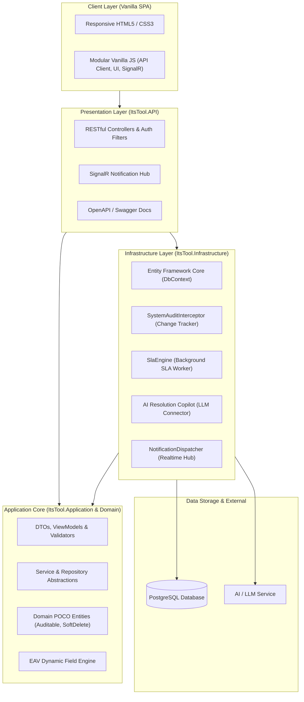
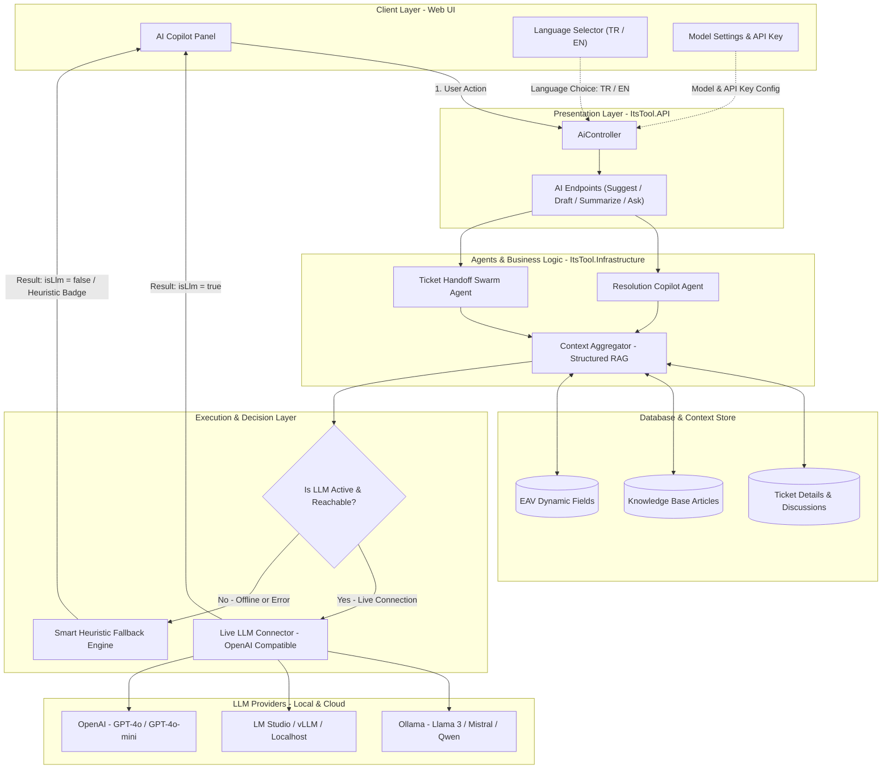
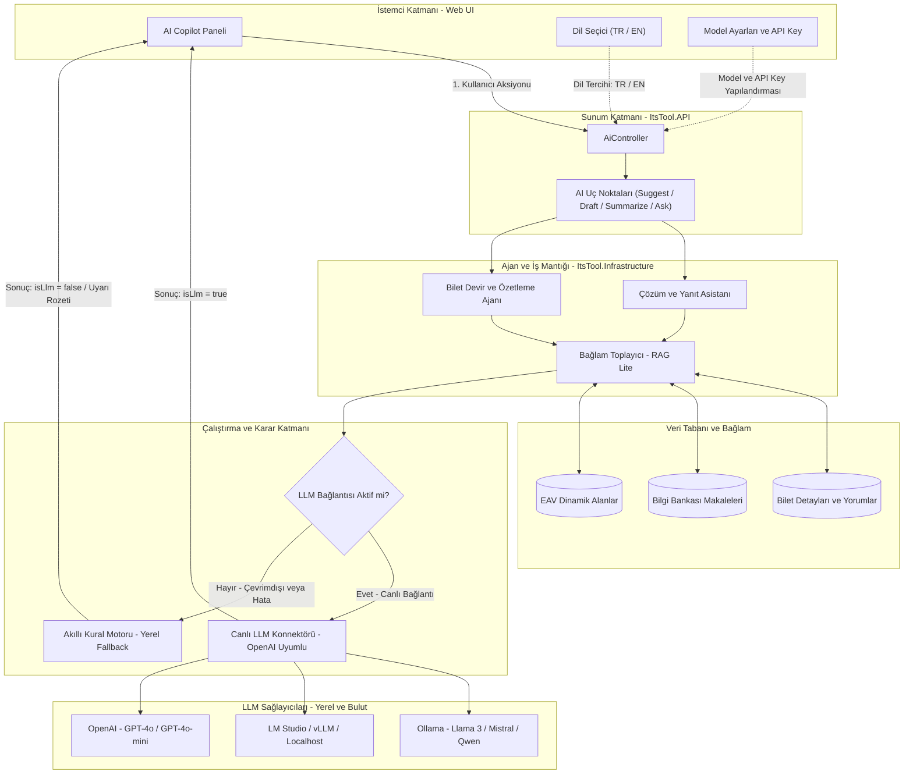

<div align="center">

# ⚡ ITSM Tool — Enterprise .NET 8 IT Service Management & AI Copilot Suite

[](https://dotnet.microsoft.com/)
[](https://www.postgresql.org/)
[](https://www.axelos.com/certifications/itil-service-management)
[](https://blog.cleancoder.com/uncle-bob/2012/08/13/the-clean-architecture.html)
[-4E9BCD?style=for-the-badge&logo=sonarqube&logoColor=white)](http://localhost:9000)
[](.github/workflows/ci.yml)
[](docker-compose.yml)
[](tests/ItsTool.UnitTests)
[](tests/ItsTool.UnitTests)
[](LICENSE)

<p align="center">
  <b>Production-ready, modular, and AI-powered IT Service Management platform natively built for the modern .NET ecosystem.</b>
  <br />
  <i>Clean Architecture • Entity-Attribute-Value (EAV) Dynamic Forms • Structured Hybrid RAG Copilot • Real-Time SignalR • Dynamic SLA Engine</i>
</p>

<p align="center">
  <b>🌐 Language / Dil:</b>
  <a href="#-english"><b>🇬🇧 English Documentation</b></a> • <a href="#-türkçe"><b>🇹🇷 Türkçe Dokümantasyon</b></a>
</p>

---

</div>

# 🇬🇧 English

[Features](#-key-features) • [Why ITSM Tool?](#-why-itsm-tool-the-open-source-gap) • [Tech Stack](#️-detailed-technology-stack) • [Architecture & Design](#-how-it-was-built-architecture--design-choices) • [System Architecture](#️-system-architecture) • [AI & RAG Architecture](#-artificial-intelligence-ai--llm-copilot-architecture) • [Quality & SonarQube](#-code-quality--sonarqube) • [Quick Start](#-quick-start) • [Roadmap](#-roadmap) • [Contributing](#-contributing)

---

## 🌟 Key Features

| Category | Capability & Description |
| :--- | :--- |
| 🤖 **AI Resolution Copilot** | Analyzes ticket history, technician discussions, and past resolved cases to produce **grounded resolution steps**, **customer-ready draft replies**, **KB article matches**, and **intelligent handoff summaries**. |
| ⏱️ **Dynamic SLA Engine** | Configurable first-response & resolution target thresholds by priority/project; automatic counter pause on `On Hold`; business hours calculation and **proactive pre-breach escalation warnings**. |
| 📋 **EAV Dynamic Form Engine** | Define custom fields per project and category without database schema alterations (Text, Number, Date, Dropdown, Multi-Select). |
| 🔄 **State Machine & Workflows** | ITIL-aligned Incident / Request lifecycle; dynamically governed transition rules via the admin console (`WorkflowTransitions`). |
| 🛡️ **Advanced Authorization (RBAC+)** | Built on Role-Based Access Control (RBAC), augmented with a **Claim Override** architecture that allows adding or revoking individual permissions per user. |
| ⚡ **Real-Time Communication (SignalR)** | Ticket assignments, status changes, SLA alerts, and `@mention` notifications are instantly pushed to client browsers. |
| 📊 **Admin Dashboard & Analytics** | KPI cards, SLA compliance trends, department/agent workload heatmaps, filtering, and CSV/PDF export. |
| 🔍 **Knowledge Base (KB)** | Frequently asked questions, category hierarchy, rich-text markdown articles, view counters, and **Four-Eyes Approval** workflow. |
| 🎨 **Zero-Bloat Vanilla UI** | Dependency-free, lightning-fast responsive interface featuring **Dark / Light theme** and **TR / EN multilingual** support. |

---

## 💡 Why ITSM Tool? (The Open-Source Gap)

While the open-source helpdesk ecosystem is heavily dominated by legacy **PHP** (GLPI, osTicket, FreeScout) or **Ruby** (Zammad) codebases, enterprise engineering teams running .NET have historically lacked a modern, ITIL-compliant, production-grade service management platform.

**ITSM Tool fills this market gap** by delivering a pure **.NET 8 LTS (C# 12)** Clean Architecture solution equipped with modern enterprise features:

| Capability | ITSM Tool (.NET 8) | Legacy Open-Source (osTicket / GLPI) | Commercial Giants (ServiceNow / Jira SM) |
| :--- | :---: | :---: | :---: |
| **Technology Stack** | **Modern .NET 8 LTS & C# 12** | PHP 7/8 / Perl | Proprietary Cloud Monolith |
| **Architecture** | **Clean / Onion Architecture** | Procedural / Monolithic | Black-box SaaS |
| **AI Copilot & RAG** | **Built-in (Zero-Cost Local & Cloud)** | ❌ None | 💰 Expensive Enterprise Add-on |
| **Dynamic Form Schemas** | **Entity-Attribute-Value (EAV)** | Hardcoded SQL Columns | Complex Custom Table Schema |
| **Real-Time Push** | **Native WebSockets (SignalR)** | Polling / Cron Refresh | Webhooks / Polling |
| **Test Verification** | **534 Tests (96.89% Line, 95.09% Branch)** | Variable / Sparse | Closed-Source Proprietary |
| **Self-Hosted Deployment** | **One-Command Docker Compose** | Complex LAMP / Extension Stack | SaaS Only / No Self-Hosting |

---

## 🛠️ Detailed Technology Stack

| Area | Technology & Library | Purpose & Architectural Role |
| :--- | :--- | :--- |
| **Backend** | **.NET 8 (C# 12)** / ASP.NET Core | High-performance, asynchronous, and modular RESTful API architecture |
| **Database & ORM** | **PostgreSQL 16** / **EF Core 8** (Npgsql) | Relational data persistence, Code-First migrations, Transactions & Interceptors |
| **Real-Time Communication** | **ASP.NET Core SignalR** | Instant push notifications for assignments, status changes, and SLA alerts |
| **Artificial Intelligence (AI)** | **Multi-Agent AI Copilot (LLM)** | Resolution recommendations and draft generation analyzing past tickets & KB |
| **Frontend** | **Vanilla JS (ES6+ Modules)**, HTML5, CSS3 | Zero-bloat, ultra-fast render, Dark/Light theme, and i18n localization dictionary |
| **Charts & Visualization** | **Chart.js** & **Bootstrap 5 (Grid/Modal)** | Dynamic KPI, SLA compliance, and ticket distribution charts on executive dashboards |
| **Containerization** | **Docker** & **Docker Compose** | Multi-stage build lightweight production images and one-command PostgreSQL orchestration |
| **Continuous Integration (CI)** | **GitHub Actions** | Automated Ubuntu provisioning, build, and test verification on pushes and PRs |
| **Unit Testing** | **xUnit**, **Moq**, **Coverlet** | 534 unit tests with 96.89% line coverage and 95.09% branch coverage |
| **Static Code Analysis** | **SonarQube** | Full Quality Gate pass with 0 Bugs, 0 Vulnerabilities, and 0 Code Smells |
| **API Documentation** | **Swagger / OpenAPI (Swashbuckle)** | Interactive API testing documentation with JWT Bearer authentication support |
| **Security** | **JWT & Claim Override (RBAC+)** | PBKDF2 salted hashing, per-user claim overrides, and ReDoS-preventing regex timeouts |

---

## 💡 How It Was Built (Architecture & Design Choices)

1. **Clean Architecture (Onion Architecture):**
   - Dependencies strictly point inward (`Domain` <- `Application` <- `Infrastructure` <- `API`).
   - `ItsTool.Domain` consists purely of C# POCO objects with zero third-party database dependencies, keeping business rules framework-agnostic.
2. **EAV (Entity-Attribute-Value) Dynamic Form Engine:**
   - Different projects (e.g., "Employee Department" for HR, "Git Commit Hash" for Software) demand distinct fields. Instead of frequent table alters, the EAV pattern enables dynamic form field definitions directly from the admin UI.
3. **Dynamic Workflow State Machine:**
   - Which roles can transition an "Open" ticket to "Resolved"? These rules are not hardcoded in C# logic; they are dynamically configured and validated through the `WorkflowTransitions` table.
4. **Resilient Background Services (Hosted Background Services):**
   - `SlaCheckerService`: Runs every minute in the background to identify tickets approaching breach or already breached, pushing audio-visual alerts to relevant agents via SignalR.
   - `EmailBackgroundService`: Asynchronously consumes outgoing emails via an `InMemoryEmailQueue` without blocking the HTTP request pipeline.
5. **Automated Audit Trail (SystemAuditInterceptor):**
   - Hooked into EF Core's Change Tracker, this interceptor automatically records previous and updated values along with actor metadata to `SystemAuditLogs` whenever a ticket or user entity is mutated.

---

## 🏛️ System Architecture

The project strictly follows **Clean Architecture (Onion Architecture)** principles, targeting loose coupling and high testability across all system layers:



### 📁 Directory Structure

```
itsm-tool/
├── src/
│   ├── ItsTool.Domain/          # Pure business models, Entities, EAV structures, Base interfaces
│   ├── ItsTool.Application/     # Use-case interfaces, DTOs, service contracts, validators
│   ├── ItsTool.Infrastructure/  # EF Core DbContext, PostgreSQL mappings, SLA & AI services
│   ├── ItsTool.API/             # ASP.NET Core Web API, JWT Auth, SignalR Hub, Controllers
│   └── ItsTool.Web/             # Vanilla JS, responsive HTML5 pages, and static assets (wwwroot)
├── tests/
│   └── ItsTool.UnitTests/       # 534 unit tests, comprehensive branch boosters, InMemory SQLite
└── docs/                        # Architectural design, ERD diagrams, requirements, development notes
```

---

## 🧠 Artificial Intelligence (AI / LLM) Copilot Architecture

ITSM Tool features a **hybrid, multi-layered artificial intelligence architecture** engineered to alleviate operational load for support engineers, minimize Mean Time to Resolution (MTTR), and standardize resolution quality.

### 📐 AI Copilot Flowchart



---

### 🔑 The 6 Core Pillars of Our AI Architecture

#### 1. 🛡️ Dual-Engine Fallback & High Availability Guarantee
- **Problem:** When cloud-hosted LLM APIs suffer outages, rate-limits, or local models encounter out-of-memory states, technician dashboards must never freeze.
- **Solution:** The platform operates under a strict **Zero Downtime** philosophy:
  - If a live LLM connection is healthy, deep generative model outputs are rendered (`isLlm: true`).
  - If the LLM is unreachable or disabled, the system **never throws an exception**; it seamlessly delegates to the **Smart Heuristic Fallback Engine** (`isLlm: false`), which analyzes category, priority, historical interventions, and related KB articles locally.
  - UI transparency informs the user that the resolution was generated via the rule engine, advising model configuration checks if an external LLM is preferred.

#### 2. 📚 Structured Multi-Source Hybrid RAG Architecture
Rather than relying on ungrounded free-text vector searches, ITSM Tool utilizes a purpose-built **Structured Multi-Source Hybrid RAG** architecture tailored for enterprise IT support. By unifying relational data hierarchies, verified enterprise knowledge bases, and historical ticket experience, it provides zero-hallucination context grounding.

##### 🔄 RAG Workflow & Stages:
1. **Taxonomy & Entity-Filtered Retrieval:**
   - Evaluates the active ticket's category (`CategoryId`), priority (`PriorityId`), and tags.
   - Searches historical closed and resolved tickets (`GetSimilarTicketsAsync`) to retrieve verified ground-truth references (*Few-Shot In-Context Learning*).
2. **Knowledge Base Lexical & Semantic Retrieval (KB Retrieval):**
   - Queries the corporate Knowledge Base (`KnowledgeArticles`) based on ticket title and category.
   - Injects approved guides, standard operating procedures (SOPs), and FAQs to impart institutional authority.
3. **Temporal Discussion & Timeline Retrieval:**
   - Pulls user comments and technician internal notes (`TicketComments`) in chronological order.
   - Ensures the AI knows exactly what steps have been attempted, recent user feedback, and active diagnostic blockers.
4. **Schema-Aware Dynamic Field Retrieval (EAV):**
   - Aggregates dynamic custom fields attached to the ticket (`Server Name`, `Error Code`, `Affected Department`, etc.).
5. **Context Augmentation & Prompt Injection Layer:**
   - Synthesizes all retrieved signals (Ticket + Similar Cases + KB Guides + Timeline) into structured JSON and semantic text blocks.
   - Instructs the model: *"Rely strictly upon the provided verified solutions and enterprise SOPs to construct a step-by-step action plan without fabricating assumptions."*
6. **Dual-Engine Synthesis:**
   - **Live LLM:** OpenAI-compatible local/cloud models synthesize the enriched context into clean, professional guidance.
   - **Smart Heuristic Fallback:** When LLM access is unavailable, the RAG context is processed directly by the local rule engine without disruption.

##### 🎯 Why Structured RAG Over Generic Vector Databases?
- **Zero Hallucination:** Models do not guess; they ground their output on real tickets previously solved and verified by human IT engineers.
- **Ultra-Low Latency & Zero Cost:** Eliminates external vector database dependencies (Pinecone, Qdrant, etc.) and embedding API costs. Leverages PostgreSQL's optimized indexes to complete retrieval in **under 5 milliseconds**.

#### 3. 🌐 Multilingual Intelligence & Dynamic Prompt Synthesis (TR / EN)
- Switch between **🇹🇷 TR** or **🇬🇧 EN** resolution languages with a single click; preferences are persisted in `localStorage`.
- Background agents (**Resolution Copilot** and **Ticket Handoff Swarm**) dynamically formulate system instructions and prompts per language:
  - **Turkish:** Professional enterprise ITIL terminology for action steps and customer replies.
  - **English:** Aligned with international IT support standards (`Best regards`, `Diagnostic steps`, `Actionable troubleshooting`).
  - Even without an LLM connection, the heuristic fallback engine renders formatted templates in the chosen language.

#### 4. 🔌 Universal Model Compatibility (OpenAI-Compatible Multi-Provider)
Zero vendor lock-in. Full compliance with the standard OpenAI Chat Completions REST API specification:
- **Local Models (Zero-Cost / Offline):** [Ollama](https://ollama.ai/) (`Llama 3`, `Mistral`, `Qwen 2.5`, `Phi-3`), [LM Studio](https://lmstudio.ai/), [vLLM](https://github.com/vllm-project/vllm).
- **Cloud Models:** OpenAI (`GPT-4o`, `GPT-4o-mini`), Azure OpenAI, Anthropic Claude (via compatible proxies).
- **Docker Networking Bridge:** Via the `host.docker.internal:host-gateway` bridge in `docker-compose.yml`, the containerized application communicates directly with local Ollama / LM Studio instances running on the host via `http://host.docker.internal:11434`.

#### 5. 👥 Agentic Specialization & Separation of Duties
- **Resolution Copilot Agent:** Diagnoses root causes, recommends knowledge articles, generates step-by-step action items, and drafts customer-ready responses.
- **Ticket Handoff Swarm Agent:** Summarizes entire ticket histories, technical bottlenecks, and pending actions during shift changes or Tier-2 escalations.

#### 6. 🎨 Intuitive User Experience & Secure Model Governance
- **Masked API Keys with Visibility Toggle:** API keys are protected behind password inputs with an interactive eye toggle icon.
- **Non-Overlapping Header:** Dual-line responsive header layout preventing visual collisions in narrow side drawers.
- **Live Latency Benchmark:** Single-click test probe measuring real-time round-trip latency in milliseconds.
- **One-Click Draft Injection:** Instant copy or direct injection into the active ticket reply textarea.

---

## 🧪 Code Quality & SonarQube

The codebase adheres strictly to enterprise software engineering principles and static code analysis standards. **SonarQube Quality Gate** has passed with full honors:

<div align="center">

| Metric | Result | Status |
| :---: | :---: | :---: |
| **Quality Gate** | **PASSED (OK)** | 🟢 Passed |
| **Unit Tests** | **534 / 534 Passed** | 🟢 100% Success |
| **Line Coverage** | **96.89%** | 🟢 High Coverage |
| **Branch Coverage** | **95.09%** | 🟢 High Coverage |
| **Bugs** | **0** | 🟢 Zero Bug |
| **Vulnerabilities** | **0** | 🟢 Secure |
| **Security Hotspots** | **0** | 🟢 Reviewed |
| **Code Smells** | **0** | 🟢 Clean Code |
| **Duplications** | **1.2%** (<3.0% threshold) | 🟢 Excellent |

</div>

### 📊 Layer-by-Layer Test Coverage Breakdown

```
+------------------------+--------+--------+--------+
| Module                 | Line   | Branch | Method |
+------------------------+--------+--------+--------+
| ItsTool.Domain         | 94.90% | 100%   | 94.90% |
| ItsTool.Application    | 99.60% | 100%   | 99.57% |
| ItsTool.Infrastructure | 97.57% | 95.09% | 96.13% |
| ItsTool.API            | 94.35% | 95.08% | 98.30% |
+------------------------+--------+--------+--------+
| TOTAL AVERAGE          | 96.89% | 95.09% | 96.92% |
+------------------------+--------+--------+--------+
```

### 🔄 Continuous Integration (CI/CD Pipeline)

The automated GitHub Actions CI workflow (`.github/workflows/ci.yml`) runs on every `push` and `pull_request`:
1. **Environment Setup:** Configures .NET 8 SDK on Ubuntu latest.
2. **Compilation:** Restores solution dependencies and compiles `ItsTool.sln` in `Release` configuration.
3. **Automated Testing:** Executes all 534 unit tests to enforce zero-regression guarantees.
4. **Coverage Reporting:** Generates OpenCover format XML coverage reports uploaded as CI artifacts.

---

## 🚀 Quick Start

### 🐳 Method 1: One-Command Execution via Docker (Recommended)

Launch the full suite without installing PostgreSQL or .NET SDK locally:

```bash
# Clone the repository
git clone https://github.com/Berkaybbayramoglu/itsm-Tool.git
cd itsm-Tool

# Build and start all containers
docker compose up -d --build
```

> 💡 *PostgreSQL 16 and ITSM Tool API containers launch automatically, applying database schema migrations and seeding demo accounts.*  
> Open your browser and navigate to **`http://localhost:5246`** to log in.  
> To shut down containers: `docker compose down`

---

### 💻 Method 2: Local Development Setup (Manual)

#### 1. Prerequisites
- [.NET 8.0 SDK](https://dotnet.microsoft.com/download/dotnet/8.0)
- [PostgreSQL 14+](https://www.postgresql.org/download/)
- [Git](https://git-scm.com/)

#### 2. Clone the Repository
```bash
git clone https://github.com/Berkaybbayramoglu/itsm-Tool.git
cd itsm-Tool
```

#### 3. Database Configuration
Create a database named `itsm_tool` in PostgreSQL and configure `src/ItsTool.API/appsettings.Development.json`:

```json
{
  "ConnectionStrings": {
    "DefaultConnection": "Host=localhost;Port=5432;Database=itsm_tool;Username=postgres;Password=YOUR_PASSWORD"
  }
}
```

#### 4. Run the Application

**Terminal 1 — API Server:**
```bash
dotnet run --project src/ItsTool.API
```
> 💡 *Note: The API initializes the schema on first boot and invokes `DataSeeder` to seed projects, groups, SLA policies, and demo users.*

**Terminal 2 — Web Client:**
```bash
dotnet run --project src/ItsTool.Web
```

Open **`http://localhost:5246`** in your browser.

#### 5. Execute Unit Tests
```bash
dotnet test tests/ItsTool.UnitTests/ItsTool.UnitTests.csproj /p:CollectCoverage=true
```

---

## 🔑 Demo Accounts

Pre-seeded accounts ready upon system initialization (**Password for all accounts:** `123456`):

| Username | Role | Scope of Authority |
| :--- | :--- | :--- |
| `admin` | **SuperAdmin** | Full system control; SLA policies, Projects, Roles, Users, and Dynamic Forms |
| `manager` | **Manager** | Analytics, SLA reviews, Executive dashboard, and KB article approval |
| `agent1` | **Agent** | Standard Support Engineer; resolve tickets, status updates, handoffs |
| `agent2` | **Agent (Override)** | Standard Agent + Granular Claim Override granting `ticket.close` capability |
| `user1` | **EndUser** | End User; create requests, track tickets, satisfaction surveys |

---

## ⌨️ Keyboard Shortcuts (Power-User Hotkeys)

Global keyboard shortcuts are enabled across all interfaces for rapid navigation and high accessibility:

| Key / Shortcut | Function | Description |
| :---: | :--- | :--- |
| <kbd>/</kbd> | **Quick Search** | Instantly focuses the page search bar (`#searchInput`) and selects text. |
| <kbd>Esc</kbd> | **Dismiss Modals** | Closes any open modals, dropdown menus, and profile panels. |
| <kbd>?</kbd> or <kbd>Shift</kbd> + <kbd>/</kbd> | **Shortcuts Guide** | Toggles the interactive keyboard shortcut help dialog. |
| <kbd>N</kbd> | **New Ticket** | Opens the ticket creation form (`/ticket-create.html`). |
| <kbd>T</kbd> | **Ticket List** | Navigates to the ticket list and search page (`/tickets.html`). |
| <kbd>D</kbd> | **Dashboard** | Navigates to the executive dashboard (`/dashboard.html`). |

> 💡 **Shortcuts Discovery & UI Integration:**
> - **Topbar:** Click the **keyboard icon (⌨️)** in the top navigation bar at any time to open the cheat sheet.
> - **Profile Drawer:** Clicking your user avatar opens the drawer containing a **"Keyboard Shortcuts (?)"** quick link.
> - **Search Bar Badge:** A subtle `<kbd>/</kbd>` badge on the search input reminds users of the hotkey.
> - **Input-Aware Guard:** Hotkeys automatically disable while typing inside form fields (`input`, `textarea`), preventing accidental navigation.

---

## 📡 API Architecture & Key Endpoints

All endpoints are fully documented and testable interactively via Swagger UI (`http://localhost:5246/swagger`).

<details>
<summary><b>🔍 View Primary REST API Endpoints Table</b></summary>

| Module | Method | Endpoint | Description |
| :--- | :--- | :--- | :--- |
| **Auth** | `POST` | `/api/auth/login` | JWT token issuance and credential verification |
| **Tickets** | `GET` | `/api/ticket` | Paginated, filtered ticket list |
| | `POST` | `/api/ticket` | Create new ticket (including dynamic fields) |
| | `GET` | `/api/ticket/{id}` | Ticket details, discussions, attachments, audit logs |
| | `POST` | `/api/ticket/{id}/transition` | Apply permitted workflow state transition |
| | `POST` | `/api/ticket/{id}/assign` | Reassign ticket to technician or support group |
| **SLA** | `GET` | `/api/sla/policies` | Retrieve active SLA policies and target thresholds |
| | `PUT` | `/api/sla/policies/{id}` | Update SLA policy parameters |
| **AI Copilot** | `POST` | `/api/ai/tickets/{id}/suggest-resolution` | Generate AI-grounded resolution plan |
| | `POST` | `/api/ai/tickets/{id}/draft-reply` | Generate drafted response for end-user communication |
| | `POST` | `/api/ai/tickets/{id}/summarize` | Summarize ticket history and discussion timeline |
| **Dashboard** | `GET` | `/api/dashboard/overview` | KPI counts and SLA compliance percentages |
| | `GET` | `/api/dashboard/distributions` | Priority, category, and status distributions |
| **KB** | `GET` | `/api/knowledgebase/articles` | Query published articles and full-text search |
| **Dynamic Forms** | `GET` | `/api/dynamicform/fields` | Query custom dynamic form field definitions |

</details>

---

## 🗺️ Roadmap

- [x] **Core ITSM & ITIL Foundation:** Incident & Request Management lifecycle with state transitions.
- [x] **EAV Dynamic Forms:** Custom schema builder without database migrations.
- [x] **AI Resolution Copilot:** Structured Multi-Source Hybrid RAG with Dual-Engine Fallback.
- [x] **Governance & Security:** Four-Eyes approval principle and RBAC+ claim overrides.
- [x] **Quality Assurance:** 534 unit tests with >95% branch coverage & SonarQube A Quality Gate.
- [ ] **v1.1 — CMDB & Asset Management:** Hardware & software configuration item relationship mapping.
- [ ] **v1.2 — ChatOps & Webhooks:** Native Slack & Microsoft Teams incident alerting bots.
- [ ] **v1.3 — Semantic Embedding Cache:** Native `pgvector` hybrid search layer for large-scale enterprise KB articles.

---

## 🤝 Contributing

Contributions, issues, and feature requests are welcome! Feel free to check the [issues page](https://github.com/Berkaybbayramoglu/itsm-Tool/issues).

1. Fork the Project
2. Create your Feature Branch (`git checkout -b feature/AmazingFeature`)
3. Commit your Changes (`git commit -m 'feat: add AmazingFeature'`)
4. Push to the Branch (`git push origin feature/AmazingFeature`)
5. Open a Pull Request

---

## 🔒 Security & Standards

- **Authorization:** Claim-based JWT Bearer authentication with granular privilege evaluation.
- **Audit Trail:** EF Core `SystemAuditInterceptor` captures comprehensive historical changelogs across entities.
- **ReDoS Mitigation:** Strict regex execution timeouts across search and HTML sanitization routines (CWE-1333).
- **Cryptographic Security:** PBKDF2 with HMAC-SHA256 password salting via ASP.NET Identity PasswordHasher.
- **Soft Deletion:** Preserves referential integrity and prevents accidental data loss via `ISoftDelete`.

---

## 📄 License

This project is licensed under the [MIT License](LICENSE).

---

<div align="center">
  <b>Author:</b> Berkay Bayramoğlu • <a href="mailto:berkaybbayramoglu@gmail.com">berkaybbayramoglu@gmail.com</a>
  <br />
  <sub>If you find this project valuable, please consider giving it a ⭐️ <b>Star</b> on GitHub!</sub>
</div>

---

# 🇹🇷 Türkçe

<p align="center">
  <b>Modern, modüler, yapay zeka destekli ve kurumsal ITIL süreçleriyle tam uyumlu yeni nesil BT Hizmet Yönetimi (ITSM) Platformu.</b>
  <br />
  <i>Clean Architecture • Entity-Attribute-Value (EAV) Dinamik Formlar • AI Resolution Copilot • Gerçek Zamanlı SignalR • Dinamik SLA Motoru</i>
</p>

[Özellikler](#-öne-çıkan-özellikler) • [Neden ITSM Tool?](#-neden-itsm-tool-açık-kaynak-ekosistemindeki-büyük-boşluk) • [Teknoloji Yığını](#️-detaylı-teknoloji-yığını-tech-stack) • [Mimari](#-sistem-mimarisi) • [AI / LLM Mimarisi](#-yapay-zeka-ai--llm-copilot-mimarisi) • [Klavye Kısayolları](#-klavye-kısayolları-power-user-hotkeys) • [Test & SonarQube](#-kod-kalitesi--sonarqube) • [Kurulum](#-hızlı-kurulum) • [Yol Haritası](#-yol-haritası-roadmap) • [Demo Hesaplar](#-demo-hesaplar) • [API Dokümantasyonu](#-api-mimarisi--başlıca-endpointler)

---

## 🌟 Öne Çıkan Özellikler

| Kategori | Yetenek & Açıklama |
| :--- | :--- |
| 🤖 **AI Resolution Copilot** | Bilet geçmişi, kullanıcı yorumları ve benzer biletleri analiz ederek **otomatik çözüm önerileri**, **taslak yanıtlar**, **makale eşleştirmeleri** ve **akıllı devir (handoff)** özetleri üretir. |
| ⏱️ **Dinamik SLA Motoru** | Öncelik ve proje bazlı özelleştirilebilir ilk yanıt & çözüm süreleri; bekleme durumunda (`On Hold`) otomatik sayaç durdurma; mesai saati hesaplaması ve **ihlal öncesi proaktif eskalasyon uyarıları**. |
| 📋 **EAV Dinamik Form Motoru** | Kod değişikliği gerektirmeden proje ve kategori bazlı özel alan tanımlama (Metin, Sayı, Tarih, Açılır Liste, Çoklu Seçim). |
| 🔄 **Durum Makinesi & İş Akışları** | ITIL uyumlu Incident / Request yaşam döngüsü; admin panelinden dinamik olarak yönetilen durum geçiş kuralları (`WorkflowTransitions`). |
| 🛡️ **Gelişmiş Yetkilendirme (RBAC+)** | Rol Tabanlı Erişim Kontrolü (RBAC) üzerine inşa edilmiş, kullanıcı bazında tekil izin ekleme/çıkarma sağlayan **Claim Override** mimarisi. |
| ⚡ **Gerçek Zamanlı İletişim (SignalR)** | Bilet atamaları, durum güncellemeleri, SLA uyarıları ve `@bahsetme` bildirimleri anlık olarak tarayıcıya iletilir. |
| 📊 **Yönetici Paneli & Analitik** | KPI kartları, SLA uyum grafikleri, departman/teknisyen iş yükü ısı haritaları, filtreleme ve CSV/PDF dışa aktarma. |
| 🔍 **Bilgi Bankası (KB)** | Sıkça sorulan sorular, kategori hiyerarşisi, zengin içerikli makaleler, görüntülenme sayaçları ve **Dört Göz Onayı (Four-Eyes Principle)** mekanizması. |
| 🎨 **Zero-Bloat Vanilla UI** | Ağır JS framework'leri olmadan ultra hızlı çalışan, responsive, **Dark / Light tema** ve **TR / EN çoklu dil** destekli modern arayüz. |

---

## 💡 Neden ITSM Tool? (Açık Kaynak Ekosistemindeki Büyük Boşluk)

Açık kaynak yardım masası (Helpdesk / ITSM) dünyasında popüler araçların ezici çoğunluğu eski **PHP** (GLPI, osTicket, FreeScout) veya **Ruby** (Zammad) teknolojileriyle geliştirilmiştir. .NET ekosisteminde kurumsal standartlarda, ITIL uyumlu ve modern açık kaynaklı bir ITSM çözümü neredeyse hiç bulunmamaktadır.

**ITSM Tool bu büyük boşluğu doldurur:** .NET 8 LTS ve C# 12'nin yüksek performansını, Clean Architecture (Soğan Mimarisi), dinamik EAV formları ve **Çok Kaynaklı Yapılandırılmış Hibrit RAG (Structured Multi-Source Hybrid RAG)** yapay zeka ajanlarıyla harmanlayarak kurumsal ölçekte eksiksiz bir çözüm sunar.

| Yetenek / Özellik | ITSM Tool (.NET 8) | Geleneksel Açık Kaynak (osTicket / GLPI) | Ticari Çözümler (ServiceNow / Jira SM) |
| :--- | :---: | :---: | :---: |
| **Teknoloji Yığını** | **Modern .NET 8 LTS & C# 12** | PHP 7/8 / Perl | Kapalı Bulut Monoliti |
| **Yazılım Mimarisi** | **Clean / Onion Architecture** | Prosedürel / Monolitik | Kapalı Kutu SaaS |
| **AI Copilot & RAG** | **Yerleşik (Sıfır Maliyetli Yerel + Bulut)** | ❌ Mevcut Değil | 💰 Çok Yüksek Lisans Maliyeti |
| **Dinamik Form Yapısı** | **Entity-Attribute-Value (EAV)** | Sabit SQL Tabloları | Karmaşık Özel Tablolar |
| **Canlı Bildirimler** | **Yerel WebSockets (SignalR)** | Periyodik Yenileme (Polling) | Webhooks / Polling |
| **Test & Kalite** | **534 Test (%96.89 Satır, SonarQube A)** | Düşük / Belirsiz | Kapalı Kod |
| **Dağıtım / Kurulum** | **Tek Komutla Docker Compose** | Karmaşık LAMP / Eklenti Kurulumu | Yalnızca SaaS / Sunucuya Kurulamaz |

---

## 🛠️ Detaylı Teknoloji Yığını (Tech Stack)

| Alan | Teknoloji & Kütüphane | Kullanım Amacı & Mimari Rolü |
| :--- | :--- | :--- |
| **Backend** | **.NET 8 (C# 12)** / ASP.NET Core | Yüksek performanslı, asenkron ve modüler RESTful API mimarisi |
| **Veritabanı & ORM** | **PostgreSQL 16** / **EF Core 8** (Npgsql) | İlişkisel veri saklama, Code-First migration'lar, Transaction & Interceptor desteği |
| **Gerçek Zamanlı İletişim** | **ASP.NET Core SignalR** | Bilet atama, durum değişikliği ve SLA uyarılarının istemcilere anlık push edilmesi |
| **Yapay Zeka (AI)** | **Multi-Agent AI Copilot (LLM)** | Geçmiş çözülmüş biletleri ve KB makalelerini analiz ederek çözüm önerisi ve taslak yanıt üretimi |
| **Frontend** | **Vanilla JS (ES6+ Modules)**, HTML5, CSS3 | Sıfır bağımlılık şişkinliği (zero-bloat), ultra hızlı render, Dark/Light tema ve i18n dil sözlüğü |
| **Grafik & Görselleştirme** | **Chart.js** & **Bootstrap 5 (Grid/Modal)** | Yönetici dashboard'unda KPI, SLA uyum ve bilet dağılım grafiklerinin dinamik çizimi |
| **Konteynerizasyon** | **Docker** & **Docker Compose** | Multi-stage build ile hafif üretim imajları ve tek komutla izole PostgreSQL orkestrasyonu |
| **Sürekli Entegrasyon (CI)**| **GitHub Actions** | Push ve PR'larda otomatik Ubuntu ortamı kurulumu, derleme ve test doğrulama |
| **Birim Testleri** | **xUnit**, **Moq**, **Coverlet** | 534 birim testi, %96.89 satır kapsamı ve %95.09 dal kapsamı |
| **Statik Kod Analizi** | **SonarQube** | 0 Bug, 0 Güvenlik Açığı, 0 Code Smell ile tam Kalite Kapısı (Quality Gate) onayı |
| **API Dokümantasyonu** | **Swagger / OpenAPI (Swashbuckle)** | JWT Bearer kimlik doğrulaması destekli interaktif API test arayüzü |
| **Güvenlik** | **JWT & Claim Override (RBAC+)** | PBKDF2 parola tuzlama, kullanıcı bazlı tekil izin ezme, ReDoS önleyici Regex zaman aşımları |

---

## 💡 Nasıl Yapıldı? (Mimari ve Tasarım Tercihleri)

1. **Clean Architecture (Onion Mimarisi):**
   - Bağımlılıklar daima dıştan içe (Domain <- Application <- Infrastructure <- API) doğrudur.
   - `ItsTool.Domain` tamamen saf C# POCO nesneleridir, hiçbir harici veritabanı kütüphanesine bağımlı değildir. Bu sayede iş mantığı teknolojiden bağımsız kalır.
2. **EAV (Entity-Attribute-Value) Dinamik Form Motoru:**
   - Farklı projeler (örn. İK için "Çalışan Departmanı", Yazılım için "Git Commit Hash") farklı alanlar gerektirir. Veritabanında her seferinde tablo değiştirmek yerine EAV deseni uygulanarak admin panelinden anlık yeni form alanları tanımlanabilir.
3. **Dinamik Durum Makinesi (Workflow State Machine):**
   - "Açık" bileti kimler "Çözüldü" yapabilir? Bu kurallar C# koduna hardcode edilmemiştir. `WorkflowTransitions` tablosu üzerinden dinamik olarak yapılandırılır ve doğrulanır.
4. **Kesintisiz Arka Plan Görevleri (Hosted Background Services):**
   - `SlaCheckerService`: Her dakika arka planda çalışarak süresi dolmak üzere olan veya ihlal edilen biletleri tespit eder, SignalR üzerinden ilgili teknisyenlere sesli/görsel uyarı gönderir.
   - `EmailBackgroundService`: E-posta gönderimlerini ana thread'i bloke etmeden `InMemoryEmailQueue` üzerinden asenkron tüketir.
5. **Otomatik Denetim İzi (SystemAuditInterceptor):**
   - EF Core Change Tracker'a bağlanan interceptor, herhangi bir bilet veya kullanıcı güncellendiğinde hangi alanın eski değerinin ne olduğunu, yeni değerinin ne olduğunu ve işlemi kimin yaptığını `SystemAuditLogs` tablosuna yazar.

---

## 🏛️ Sistem Mimarisi

Proje, **Clean Architecture (Onion Architecture)** prensiplerine tam sadık kalınarak katmanlar arası gevşek bağlılık (loose coupling) ve yüksek test edilebilirlik hedefiyle inşa edilmiştir:


### 📁 Katman Yapısı

```
itsm-tool/
├── src/
│   ├── ItsTool.Domain/          # Saf iş modelleri, Entity'ler, EAV yapıları, Base interfaceler
│   ├── ItsTool.Application/     # İş kuralları arayüzleri, DTO'lar, servis sözleşmeleri
│   ├── ItsTool.Infrastructure/  # EF Core DbContext, PostgreSQL eşleşmeleri, SLA & AI servisleri
│   ├── ItsTool.API/             # ASP.NET Core Web API, JWT Auth, SignalR Hub, Controller'lar
│   └── ItsTool.Web/             # Vanilla JS, responsive HTML5 sayfaları ve statik varlıklar (wwwroot)
├── tests/
│   └── ItsTool.UnitTests/       # 534 birim ve entegrasyon testi, InMemory SQLite altyapısı
└── docs/                        # Mimari tasarım, ERD, gereksinim ve geliştirme notları
```

---

## 🧠 Yapay Zeka (AI / LLM) Copilot Mimarisi

ITSM Tool, destek temsilcilerinin operasyonel yükünü hafifletmek, bilet çözüm sürelerini (MTTR) minimize etmek ve yanıt kalitesini standartlaştırmak için **hibrit ve çok katmanlı bir yapay zeka mimarisine** sahiptir.

### 📐 AI Copilot Akış Şeması



---

### 🔑 AI Mimarimizin 6 Temel İlkesi

#### 1. 🛡️ Çift Modlu Çalışma & Kesintisiz Hizmet Garantisi (Dual-Engine Fallback)
- **Problem:** Bulut tabanlı LLM API'larında ağ kesintileri, hız kısıtlamaları (rate-limit) veya yerel modellerde bellek yetersizliği yaşandığında destek teknisyeninin ekranı donmamalıdır.
- **Çözüm:** Sistem **Sıfır Kesinti (Zero Downtime)** prensibiyle çalışır:
  - Canlı LLM bağlantısı varsa derinlemesine model çıktısı alınır (`isLlm: true`).
  - LLM erişilemezse veya kapalıysa, sistem **asla hata fırlatmaz**; anında bilet kategorisini, önceliğini, geçmiş müdahalelerini ve ilgili KB makalelerini analiz eden **yerel kural motoruna (Smart Heuristic Fallback)** devredilir (`isLlm: false`).
  - Kullanıcı arayüzünde şeffaflık sağlanarak yanıtın kural motorundan geldiği ve harici model bağlamak için ayarların kontrol edilmesi gerektiği açıkça belirtilir.

#### 2. 📚 RAG Mimarisi: Çok Kaynaklı Yapılandırılmış Hibrit RAG (Structured Multi-Source Hybrid RAG)
ITSM Tool, genel geçer serbest metin vektör aramaları yerine kurumsal BT destek süreçlerine özel olarak tasarlanmış **Structured Multi-Source Hybrid RAG (Çok Kaynaklı Yapılandırılmış Hibrit RAG)** mimarisini kullanır. Bu mimari, sistemdeki ilişkisel veri hiyerarşisi, kurumsal bilgi bankası ve geçmiş bilet tecrübesini birleştirerek modele sıfır halüsinasyon garantisiyle bağlam sunar.

##### 🔄 RAG Çalışma Akışı ve Aşamaları:
1. **Taksonomi ve Varlık Filtreli Getirim (Taxonomy & Entity-Filtered Retrieval):**
   - Aktif biletin kategori (`CategoryId`), öncelik (`PriorityId`) ve etiketleri analiz edilir.
   - Veritabanındaki binlerce bilet taranarak aynı kategoride daha önce başarıyla **kapatılmış ve çözülmüş biletler** (`GetSimilarTicketsAsync`) doğrulanmış çözüm referansları (*Ground Truth / Few-Shot In-Context Learning*) olarak çekilir.
2. **Bilgi Bankası Sözlüksel & Semantik Getirimi (KB Retrieval):**
   - Bilet başlığı ve kategori kimliği üzerinden kurumsal Bilgi Bankası (`KnowledgeArticles`) taranır.
   - Onaylanmış kurumsal kılavuzlar, sıkça sorulan sorular ve standart işletim prosedürleri (SOP) getirilerek yanıta resmiyet kazandırılır.
3. **Kronolojik Etkileşim ve Zaman Çizelgesi Getirimi (Temporal Discussion Retrieval):**
   - Bilet altındaki kullanıcı yorumları ve teknisyenin dahili notları (`TicketComments`) kronolojik sırayla çekilir.
   - Böylece yapay zeka, bilet üzerinde şimdiye kadar hangi adımların denendiğini, kullanıcının verdiği son geri bildirimleri ve devam eden aksiyonları eksiksiz bilir.
4. **Dinamik EAV Alanları Getirimi (Schema-Aware Dynamic Field Retrieval):**
   - Bilete form motoru tarafından eklenmiş özel dinamik alanlar (`Sunucu Adı`, `Hata Kodu`, `Etkilenen Departman` vb.) toplanır.
5. **Bağlamsal Zenginleştirme ve Prompt Enjeksiyonu (Augmentation Layer):**
   - Toplanan tüm veriler (Bilet + Çözülmüş Benzer Vakalar + KB Makaleleri + Zaman Çizelgesi), yapılandırılmış JSON ve semantik metin blokları halinde prompt'a gömülür.
   - Modele: *"Yalnızca sana sunulan geçmiş başarılı çözümlere ve kurumsal bilgi bankası prosedürlerine sadık kalarak, halüsinasyon üretmeden BT teknisyeni için adım adım aksiyon planı oluştur"* talimatı verilir.
6. **Çift Motorlu Sentez (Dual-Engine Synthesis):**
   - **Canlı LLM:** OpenAI uyumlu yerel/bulut modeller zenginleştirilmiş bağlamı sentezleyip kurumsal ve temiz bir rehber üretir.
   - **Akıllı Yerel Kural Motoru (Smart Heuristic Fallback):** LLM kapalı veya erişilemez olduğunda, toplanan bu RAG bağlamı yerel kural motoru tarafından doğrudan işlenerek teknisyenin ekranına kesintisiz ulaştırılır.

##### 🎯 Neden Klasik Vektör DB Yerine Yapılandırılmış RAG?
- **Sıfır Halüsinasyon:** Model rastgele tahminlerde bulunmaz; daha önce BT ekiplerince çözülüp kapatılmış gerçek bilet kayıtlarını baz alır.
- **Ultra Düşük Gecikme & Sıfır Maliyet:** Harici vektör veritabanı (Pinecone, Qdrant vb.) veya harici embedding API bağımlılığı olmadan, PostgreSQL'in güçlü ilişkisel indeksleri sayesinde getirim işlemi **5 milisaniyenin altında** gerçekleşir.

#### 3. 🌐 Çok Dilli Zeka & Prompt Sentezi (TR / EN)
- Arayüz üzerinden tek tıkla **🇹🇷 TR** veya **🇬🇧 EN** yanıt dili seçilebilir ve tercih `localStorage` üzerinde saklanır.
- Arka plandaki akıllı ajanlar (**Çözüm ve Yanıt Asistanı** ile **Bilet Devir ve Özetleme Ajanı**), seçilen dile göre dinamik sistem talimatları ve kullanıcı prompt'ları oluşturur:
  - **Türkçe:** Kurumsal ve profesyonel Türkçe ITIL dili ile çözüm adımları ve müşteri bildirimleri.
  - **İngilizce:** Uluslararası IT destek standartlarına (`Best regards`, `Diagnostic steps`, `Actionable troubleshooting`) tam uyumlu İngilizce çıktılar.
  - LLM bağlı olmadığında dahi yerel motor, seçilen dilde profesyonel şablonlar üretir.

#### 4. 🔌 Evrensel Model Uyumluluğu (OpenAI-Compatible Multi-Provider)
Sistem tek bir sağlayıcıya kilitlenmez (`Vendor Lock-in` yoktur). Standart OpenAI Chat Completions REST API spesifikasyonunu destekler:
- **Yerel Modeller (Zero-Cost / Offline):** [Ollama](https://ollama.ai/) (`Llama 3`, `Mistral`, `Qwen 2.5`, `Phi-3`), [LM Studio](https://lmstudio.ai/), [vLLM](https://github.com/vllm-project/vllm).
- **Bulut Modelleri:** OpenAI (`GPT-4o`, `GPT-4o-mini`), Azure OpenAI, Anthropic Claude (uyumlu proxy'ler üzerinden).
- **Docker İçi Ağ İletişimi:** `docker-compose.yml` içerisindeki `host.docker.internal:host-gateway` köprüsü sayesinde, Docker içinde koşan ITSM Tool, host makinede çalışan yerel Ollama/LM Studio servislerine doğrudan `http://host.docker.internal:11434` üzerinden erişebilir.

#### 5. 👥 Çoklu Ajan ve Görev Ayrımı (Agentic Specialization)
- **Çözüm ve Yanıt Asistanı (Resolution Copilot):** Bilet için teşhis adımları, muhtemel kök nedenler, ilgili bilgi bankası (KB) makaleleri ve son kullanıcıya iletilebilecek hazır e-posta / yorum taslaklarını üretir.
- **Bilet Devir ve Özetleme Ajanı (Ticket Handoff):** Vardiya değişimlerinde, teknisyen atamalarında veya 2. Seviye (Tier-2) uzman desteğe eskalasyonlarda biletin tüm geçmişini, teknik darboğazları ve bir sonraki teknisyenin atması gereken adımları özetleyen devir notları hazırlar.

#### 6. 🎨 Sezgisel Arayüz & Güvenli Model Yönetimi
- **Göz İkonlu API Anahtarı:** Model ayarları penceresinde API anahtarı güvenle maskelenir (`type="password"`), istenildiğinde göz ikonu ile açık metne dönüştürülüp kontrol edilebilir.
- **Üst Üste Binmeyen 2 Satırlı Başlık:** Dar yan panellerde taşma ve çakışmaları önleyen modern başlık ve durum göstergesi.
- **Canlı Gecikme Testi:** Model ayarlarından tek tıkla test isteği gönderilerek milisaniye cinsinden yanıt süresi (`latency`) ve model sağlığı ölçülür.
- **Tek Tıkla Yanıta Aktarma:** Üretilen taslak tek tıkla kopyalanabilir veya doğrudan biletin yanıt kutusuna aktarılabilir.

---

## 🧪 Kod Kalitesi & SonarQube

Proje, kurumsal kodlama standartlarına ve statik kod analizi kurallarına sıkı sıkıya bağlıdır. **SonarQube Kalite Kapısı (Quality Gate)** tüm metriklerde tam başarı sağlamıştır:

<div align="center">

| Metrik | Sonuç | Durum |
| :---: | :---: | :---: |
| **Quality Gate** | **PASSED (OK)** | 🟢 Başarılı |
| **Birim Testleri** | **534 / 534 Geçti** | 🟢 %100 Başarı |
| **Satır Test Kapsamı (Line Coverage)** | **%96.89** | 🟢 Yüksek Kapsam |
| **Dal Test Kapsamı (Branch Coverage)** | **%95.09** | 🟢 Yüksek Kapsam |
| **Bugs** | **0** | 🟢 Sıfır Hata |
| **Vulnerabilities** | **0** | 🟢 Güvenli |
| **Security Hotspots** | **0** | 🟢 İncelendi |
| **Code Smells** | **0** | 🟢 Temiz Kod |
| **Kod Tekrarı (Duplications)** | **%1.2** (<%3.0 eşiği) | 🟢 Mükemmel |

</div>

### 📊 Katman Bazlı Test Kapsamı

```
+------------------------+--------+--------+--------+
| Modül                  | Satır  | Dal    | Metot  |
+------------------------+--------+--------+--------+
| ItsTool.Domain         | 94.90% | 100%   | 94.90% |
| ItsTool.Application    | 99.60% | 100%   | 99.57% |
| ItsTool.Infrastructure | 97.57% | 95.09% | 96.13% |
| ItsTool.API            | 94.35% | 95.08% | 98.30% |
+------------------------+--------+--------+--------+
| TOPLAM ORTALAMA        | 96.89% | 95.09% | 96.92% |
+------------------------+--------+--------+--------+
```

### 🔄 Sürekli Entegrasyon (CI/CD Pipeline)

GitHub Actions üzerinde koşan otomatik CI pipeline (`.github/workflows/ci.yml`), repoya yapılan her `push` ve `pull_request` işleminde:
1. **Ortam Hazırlığı:** Ubuntu üzerinde .NET 8 SDK'sını yapılandırır.
2. **Derleme:** Çözümün (`ItsTool.sln`) bağımlılıklarını geri yükler ve `Release` modda derler.
3. **Otomatik Testler:** 534 birim testini çalıştırarak kod kalitesini garanti eder.
4. **Kapsam Raporlama:** OpenCover formatında test kapsamı raporu oluşturup CI artifact olarak saklar.

---

## 🚀 Hızlı Kurulum

### 🐳 Yöntem 1: Docker ile Tek Komutla Çalıştırma (Önerilen)

Projeyi makinenize PostgreSQL veya .NET SDK kurmanıza gerek kalmadan Docker ile tek komutla başlatabilirsiniz:

```bash
# Projeyi klonlayın
git clone https://github.com/Berkaybbayramoglu/itsm-Tool.git
cd itsm-Tool

# Konteynerleri derleyin ve başlatın
docker compose up -d --build
```

> 💡 *PostgreSQL 16 ve ITSM Tool API konteynerleri otomatik ayağa kalkar, veritabanı şeması migrate edilir ve demo veriler tohumlanır.*  
> Tarayıcınızdan **`http://localhost:5246`** adresine giderek hemen giriş yapabilirsiniz.  
> Konteynerleri durdurmak için: `docker compose down`

---

### 💻 Yöntem 2: Yerel Geliştirme Ortamı (Manuel)

#### 1. Gereksinimler
- [.NET 8.0 SDK](https://dotnet.microsoft.com/download/dotnet/8.0)
- [PostgreSQL 14+](https://www.postgresql.org/download/)
- [Git](https://git-scm.com/)

#### 2. Projeyi Klonlayın
```bash
git clone https://github.com/Berkaybbayramoglu/itsm-Tool.git
cd itsm-Tool
```

#### 3. Veritabanı Yapılandırması
PostgreSQL sunucunuzda `itsm_tool` adında bir veritabanı oluşturun ve `src/ItsTool.API/appsettings.Development.json` dosyasındaki bağlantı dizesini düzenleyin:

```json
{
  "ConnectionStrings": {
    "DefaultConnection": "Host=localhost;Port=5432;Database=itsm_tool;Username=postgres;Password=YOUR_PASSWORD"
  }
}
```

#### 4. Uygulamayı Başlatın

**Terminal 1 — API Sunucusu:**
```bash
dotnet run --project src/ItsTool.API
```
> 💡 *Not: API ilk açılışta veritabanı şemasını otomatik oluşturur ve `DataSeeder` ile örnek projeleri, grupları, SLA politikalarını ve demo kullanıcıları tohumlar.*

**Terminal 2 — Web Kullanıcı Arayüzü:**
```bash
dotnet run --project src/ItsTool.Web
```

Tarayıcınızdan **`http://localhost:5246`** adresine giderek uygulamayı kullanmaya başlayabilirsiniz.

#### 5. Birim Testlerini Çalıştırma
```bash
dotnet test tests/ItsTool.UnitTests/ItsTool.UnitTests.csproj /p:CollectCoverage=true
```

---

## 🔑 Demo Hesaplar

Sistem başlatıldığında hazır gelen test kullanıcıları (**Tüm şifreler:** `123456`):

| Kullanıcı Adı | Rol | Yetki & Sorumluluk Alanı |
| :--- | :--- | :--- |
| `admin` | **SuperAdmin** | Sistem geneli tam yetki; SLA, Proje, Rol, Kullanıcı ve Dinamik Form yönetimi |
| `manager` | **Manager** | Raporlama, SLA inceleme, Yönetim panelleri ve Bilgi Bankası onayları |
| `agent1` | **Agent** | Standart Destek Temsilcisi; bilet çözme, durum güncelleme, devir alma |
| `agent2` | **Agent (Override)** | Standart Temsilci + Claim Override ile verilmiş `ticket.close` yetkisi |
| `user1` | **EndUser** | Son kullanıcı; talep açma, kendi biletlerini izleme, memnuniyet anketi |

---

## ⌨️ Klavye Kısayolları (Power-User Hotkeys)

Sistem genelinde hızlı gezinme, operasyonel hız ve erişilebilirlik için global klavye kısayolları tanımlanmıştır. Herhangi bir ekrandayken fare kullanmadan kritik aksiyonları tetikleyebilirsiniz:

| Tuş / Kısayol | Fonksiyon | Açıklama |
| :---: | :--- | :--- |
| <kbd>/</kbd> | **Hızlı Arama** | Sayfadaki arama çubuğuna (`#searchInput`) anında odaklanır ve metni seçer. |
| <kbd>Esc</kbd> | **Pencereleri Kapat** | Açık olan tüm modal pencereleri, açılır menüleri ve profil detay panelini kapatır. |
| <kbd>?</kbd> veya <kbd>Shift</kbd> + <kbd>/</kbd> | **Kısayol Rehberi** | Ekranda interaktif kısayol yardım penceresini açar / kapatır. |
| <kbd>N</kbd> | **Yeni Bilet** | Yeni bilet oluşturma formunu (`/ticket-create.html`) anında açar. |
| <kbd>T</kbd> | **Biletler Listesi** | Bilet listesi ve arama sayfasına (`/tickets.html`) yönlendirir. |
| <kbd>D</kbd> | **Dashboard** | Genel kontrol paneline (`/dashboard.html`) yönlendirir. |

> 💡 **Kısayolları Keşfetme & UI Erişimi:**
> - **Üst Çubuk (Topbar):** Tüm sayfaların sağ üst köşesinde yer alan **klavye simgesine (⌨️)** tıklayarak kısayol rehberine her an ulaşabilirsiniz.
> - **Profil Paneli:** Sağ üstteki kullanıcı avatarına tıklandığında açılan profil penceresinin altında **"Klavye Kısayolları (?)"** bağlantısı bulunur.
> - **Arama Çubuğu Rozeti:** Biletler sayfasında arama kutusunun sağında yer alan `<kbd>/</kbd>` etiketi, kısayol kullanımını görsel olarak hatırlatır.
> - **Akıllı Odaklama:** Form giriş alanlarında (input, textarea vb.) yazı yazarken kısayollar harf yazımınızı engellemez, yalnızca serbest gezinme esnasında tetiklenir.

---

## 📡 API Mimarisi & Başlıca Endpoint'ler

Tüm endpoint'ler Swagger / OpenAPI UI üzerinden interaktif olarak test edilebilir (`http://localhost:5246/swagger`).

<details>
<summary><b>🔍 Başlıca REST API Endpoint Listesini Görüntüle</b></summary>

| Modül | Metot | Endpoint | Açıklama |
| :--- | :--- | :--- | :--- |
| **Auth** | `POST` | `/api/auth/login` | JWT token üretimi ve kullanıcı doğrulaması |
| **Tickets** | `GET` | `/api/ticket` | Sayfalanmış, filtrelenmiş bilet listesi |
| | `POST` | `/api/ticket` | Yeni bilet oluşturma (Dinamik alanlar dahil) |
| | `GET` | `/api/ticket/{id}` | Bilet detayları, yorumlar, ekler ve denetim izi |
| | `POST` | `/api/ticket/{id}/transition` | İzin verilen durum geçişi uygulama |
| | `POST` | `/api/ticket/{id}/assign` | Bilet teknisyen/grup atama ve devir |
| **SLA** | `GET` | `/api/sla/policies` | SLA politikaları ve hedef süreleri |
| | `PUT` | `/api/sla/policies/{id}` | Politika ve hedef süre güncelleme |
| **AI Copilot** | `POST` | `/api/ai/tickets/{id}/suggest-resolution` | AI tabanlı çözüm önerisi üretme |
| | `POST` | `/api/ai/tickets/{id}/draft-reply` | Müşteriye iletilecek taslak yanıt oluşturma |
| | `POST` | `/api/ai/tickets/{id}/summarize` | Bilet geçmişi ve yorum özetleme |
| **Dashboard** | `GET` | `/api/dashboard/overview` | KPI sayıları, SLA uyum oranları |
| | `GET` | `/api/dashboard/distributions` | Öncelik, kategori ve durum dağılımları |
| **KB** | `GET` | `/api/knowledgebase/articles` | Yayınlanmış makaleler ve arama |
| **Dynamic Forms** | `GET` | `/api/dynamicform/fields` | Dinamik alan tanımları |

</details>

---

## 🗺️ Yol Haritası (Roadmap)

- [x] **Temel ITSM & ITIL Altyapısı:** Olay (Incident) ve Talep (Request) yönetimi yaşam döngüsü ve durum geçişleri.
- [x] **EAV Dinamik Form Motoru:** Veritabanı şeması değiştirmeden anlık özel alan mimarisi.
- [x] **AI Resolution Copilot:** Çok Kaynaklı Hibrit RAG ve Çift Motorlu Akıllı Fallback.
- [x] **Denetim ve Güvenlik:** Dört Göz Onay Prensibi ve RBAC+ yetkilendirme.
- [x] **Kalite Güvencesi:** 534 birim testi, >%95 dal kapsamı ve SonarQube A Kalite Kapısı.
- [ ] **v1.1 — CMDB & Varlık Yönetimi (Asset Management):** Donanım ve yazılım varlıklarının ilişkisel konfigürasyon haritası.
- [ ] **v1.2 — ChatOps & Bildirim Botları:** Slack ve Microsoft Teams olay bildirim ve komut botları.
- [ ] **v1.3 — Semantik Vektör Önbelleği:** Büyük ölçekli kurumsal KB makaleleri için yerleşik `pgvector` hibrit arama katmanı.

---

## 🤝 Katkıda Bulunma (Contributing)

Katkılarınızı, hata bildirimlerinizi ve özellik önerilerinizi memnuniyetle karşılıyoruz! [Issues sayfası](https://github.com/Berkaybbayramoglu/itsm-Tool/issues) üzerinden bize katılabilirsiniz.

1. Projeyi Fork'layın
2. Yeni bir Dal Açın (`git checkout -b feature/YeniOzellik`)
3. Değişikliklerinizi Commit Edin (`git commit -m 'feat: yeni özellik eklendi'`)
4. Dalınızı Push Edin (`git push origin feature/YeniOzellik`)
5. Bir Pull Request Açın

---

## 🔒 Güvenlik & Standartlar

- **Yetkilendirme:** Claim tabanlı JWT Bearer Token ile güvenli kimlik doğrulama.
- **Audit Trail:** EF Core `SystemAuditInterceptor` ile tüm varlık ekleme, güncelleme ve silme işlemlerinde kullanıcı ve zaman damgalı tam denetim izi.
- **ReDoS Koruması:** Regex aramalarında ve HTML etiket temizlemelerinde katı Regex Timeout sınırları (CWE-1333 önlemi).
- **Parola Güvenliği:** PBKDF2 / ASP.NET Identity PasswordHasher ile tuzlanmış (salted) güvenli şifreleme.
- **Soft Delete:** Veri kaybını önleyen ve ilişkisel bütünlüğü koruyan `ISoftDelete` deseni.

---

## 📄 Lisans

Bu proje [MIT Lisansı](LICENSE) kapsamında lisanslanmıştır.

---

<div align="center">
  <b>Geliştirici:</b> Berkay Bayramoğlu • <a href="mailto:berkaybbayramoglu@gmail.com">berkaybbayramoglu@gmail.com</a>
  <br />
  <sub>Proje hoşunuza gittiyse sağ üst köşeden ⭐️ <b>Star</b> vermeyi unutmayın!</sub>
</div>
