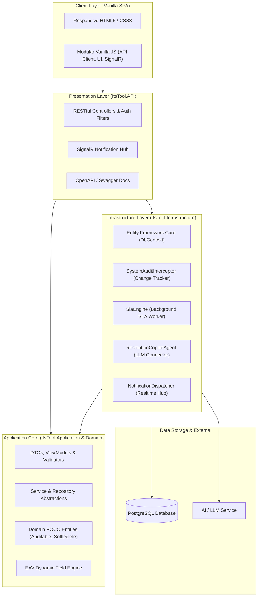

<div align="center">

# ⚡ ITSM Tool — Enterprise IT Service Management Suite

[](https://dotnet.microsoft.com/)
[](https://www.postgresql.org/)
[-4E9BCD?style=for-the-badge&logo=sonarqube&logoColor=white)](http://localhost:9000)
[](tests/ItsTool.UnitTests)
[](tests/ItsTool.UnitTests)
[](LICENSE)

<p align="center">
  <b>Modern, modüler, yapay zeka destekli ve kurumsal ITIL süreçleriyle tam uyumlu yeni nesil BT Hizmet Yönetimi (ITSM) Platformu.</b>
  <br />
  <i>Clean Architecture • Entity-Attribute-Value (EAV) Dinamik Formlar • AI Resolution Copilot • Gerçek Zamanlı SignalR • Dinamik SLA Motoru</i>
</p>

[Özellikler](#-öne-çıkan-özellikler) • [Mimari](#-sistem-mimarisi) • [Test & SonarQube](#-kod-kalitesi--sonarqube) • [Kurulum](#-hızlı-kurulum) • [Demo Hesaplar](#-demo-hesaplar) • [API Dokümantasyonu](#-api-mimarisi--başlıca-endpointler)

---

</div>

## 🌟 Öne Çıkan Özellikler

| Kategori | Yetenek & Açıklama |
| :--- | :--- |
| 🤖 **AI Resolution Copilot** | Bilet geçmişi, kullanıcı yorumları ve benzer biletleri analiz ederek **otomatik çözüm önerileri**, **taslak yanıtlar**, **makale eşleştirmeleri** ve **akıllı devir (handoff)** özetleri üretir. |
| ⏱️ **Dinamik SLA Motoru** | Öncelik ve proje bazlı özelleştirilebilir ilk yanıt & çözüm süreleri; bekleme durumunda (`On Hold`) otomatik sayaç durdurma; mesai saati hesaplaması ve **ihlal öncesi proaktif eskalasyon uyarıları**. |
| 📋 **EAV Dinamik Form Motoru** | Kod değişikliği gerektirmeden proje ve kategori bazlı özel alan tanımlama (Metin, Sayı, Tarih, Açılır Liste, Çoklu Seçim). |
| 🔄 **Durum Makinesi & İş Akışları** | ITIL uyumlu Incident / Request yaşam döngüsü; admin panelinden dinamik olarak yönetilen durum geçiş kuralları (`WorkflowTransitions`). |
| 🛡️ **Gelişmiş Yetkilendirme (RBAC+)** | Rol Tabanlı Erişim Kontrolü (RBAC) üzerine inşa edilmiş, kullanıcı bazında tekil izin ekleme/çıkarma sağlayan **Claim Override** mimarisi. |
| ⚡ **Gerçek Zamanlı İletişim (SignalR)** | Bilet atamaları, durum güncellemeleri, SLA uyarıları ve `@bahsetme` bildirimleri anlık olarak tarayıcıya iletilir. |
| 📊 **Yönetici Paneli & Analitik** | KPI kartları, SLA uyum grafikleri, departman/teknisyen iş yükü ısı haritaları, filtreleme ve CSV/PDF dışa aktarma. |
| 🔍 **Bilgi Bankası (KB)** | Sıkça sorulan sorular, kategori hiyerarşisi, zengin içerikli makaleler, görüntülenme sayaçları ve onay mekanizması. |
| 🎨 **Zero-Bloat Vanilla UI** | Ağır JS framework'leri olmadan ultra hızlı çalışan, responsive, **Dark / Light tema** ve **TR / EN çoklu dil** destekli modern arayüz. |

---

## 🏛️ Sistem Mimarisi

Proje, **Clean Architecture (Onion Architecture)** prensiplerine tam sadık kalınarak katmanlar arası gevşek bağlılık (loose coupling) ve yüksek test edilebilirlik hedefiyle inşa edilmiştir:



### 📁 Katman Yapısı

```
itsm-tool/
├── src/
│   ├── ItsTool.Domain/          # Saf iş modelleri, Entity'ler, EAV yapıları, Base interfaceler
│   ├── ItsTool.Application/     # İş kuralları arayüzleri, DTO'lar, servis sözleşmeleri
│   ├── ItsTool.Infrastructure/  # EF Core DbContext, PostgreSQL eşleşmeleri, SLA & AI servisleri
│   ├── ItsTool.API/             # ASP.NET Core Web API, JWT Auth, SignalR Hub, Controller'lar
│   └── ItsTool.Web/             # Vanilla JS, responsive HTML5 sayfaları ve statik varlıklar (wwwroot)
├── tests/
│   └── ItsTool.UnitTests/       # 302 birim ve entegrasyon testi, InMemory SQLite altyapısı
└── docs/                        # Mimari tasarım, ERD, gereksinim ve geliştirme notları
```

---

## 🧪 Kod Kalitesi & SonarQube

Proje, kurumsal kodlama standartlarına ve statik kod analizi kurallarına sıkı sıkıya bağlıdır. **SonarQube Kalite Kapısı (Quality Gate)** tüm metriklerde tam başarı sağlamıştır:

<div align="center">

| Metrik | Sonuç | Durum |
| :---: | :---: | :---: |
| **Quality Gate** | **PASSED (OK)** | 🟢 Başarılı |
| **Birim Testleri** | **302 / 302 Geçti** | 🟢 %100 Başarı |
| **Satır Test Kapsamı (Line Coverage)** | **%72.9** | 🟢 Yüksek Kapsam |
| **Bugs** | **0** | 🟢 Sıfır Hata |
| **Vulnerabilities** | **0** | 🟢 Güvenli |
| **Security Hotspots** | **0** | 🟢 İncelendi |
| **Code Smells** | **0** | 🟢 Temiz Kod |
| **Kod Tekrarı (Duplications)** | **%1.2** (<%3.0 eşiği) | 🟢 Mükemmel |

</div>

### 📊 Katman Bazlı Test Kapsamı

```
+------------------------+--------+--------+--------+
| Modül                  | Satır  | Dal    | Metot  |
+------------------------+--------+--------+--------+
| ItsTool.Domain         | 75.91% | 100%   | 75.91% |
| ItsTool.Application    | 80.09% | 100%   | 78.43% |
| ItsTool.Infrastructure | 71.74% | 47.83% | 79.29% |
| ItsTool.API            | 74.46% | 51.78% | 83.12% |
+------------------------+--------+--------+--------+
| TOPLAM ORTALAMA        | 75.55% | 74.90% | 79.18% |
+------------------------+--------+--------+--------+
```

---

## 🚀 Hızlı Kurulum

### 1. Gereksinimler
- [.NET 8.0 SDK](https://dotnet.microsoft.com/download/dotnet/8.0)
- [PostgreSQL 14+](https://www.postgresql.org/download/)
- [Git](https://git-scm.com/)

### 2. Projeyi Klonlayın
```bash
git clone https://github.com/Berkaybbayramoglu/itsm-Tool.git
cd itsm-Tool
```

### 3. Veritabanı Yapılandırması
PostgreSQL sunucunuzda `itsm_tool` adında bir veritabanı oluşturun ve `src/ItsTool.API/appsettings.Development.json` dosyasındaki bağlantı dizesini düzenleyin:

```json
{
  "ConnectionStrings": {
    "DefaultConnection": "Host=localhost;Port=5432;Database=itsm_tool;Username=postgres;Password=YOUR_PASSWORD"
  }
}
```

### 4. Uygulamayı Başlatın

**Terminal 1 — API Sunucusu:**
```bash
dotnet run --project src/ItsTool.API
```
> 💡 *Not: API ilk açılışta veritabanı şemasını otomatik oluşturur ve `DataSeeder` ile örnek projeleri, grupları, SLA politikalarını ve demo kullanıcıları tohumlar.*

**Terminal 2 — Web Kullanıcı Arayüzü:**
```bash
dotnet run --project src/ItsTool.Web
```

Tarayıcınızdan **`http://localhost:5246`** adresine giderek uygulamayı kullanmaya başlayabilirsiniz.

### 5. Birim Testlerini Çalıştırma
```bash
dotnet test tests/ItsTool.UnitTests/ItsTool.UnitTests.csproj /p:CollectCoverage=true
```

---

## 🔑 Demo Hesaplar

Sistem başlatıldığında hazır gelen test kullanıcıları (**Tüm şifreler:** `123456`):

| Kullanıcı Adı | Rol | Yetki & Sorumluluk Alanı |
| :--- | :--- | :--- |
| `admin` | **SuperAdmin** | Sistem geneli tam yetki; SLA, Proje, Rol, Kullanıcı ve Dinamik Form yönetimi |
| `manager` | **Manager** | Raporlama, SLA inceleme, Yönetim panelleri ve Bilgi Bankası onayları |
| `agent1` | **Agent** | Standart Destek Temsilcisi; bilet çözme, durum güncelleme, devir alma |
| `agent2` | **Agent (Override)** | Standart Temsilci + Claim Override ile verilmiş `ticket.close` yetkisi |
| `user1` | **EndUser** | Son kullanıcı; talep açma, kendi biletlerini izleme, memnuniyet anketi |

---

## 📡 API Mimarisi & Başlıca Endpoint'ler

Tüm endpoint'ler Swagger / OpenAPI UI üzerinden interaktif olarak test edilebilir (`http://localhost:5246/swagger`).

<details>
<summary><b>🔍 Başlıca REST API Endpoint Listesini Görüntüle</b></summary>

| Modül | Metot | Endpoint | Açıklama |
| :--- | :--- | :--- | :--- |
| **Auth** | `POST` | `/api/auth/login` | JWT token üretimi ve kullanıcı doğrulaması |
| **Tickets** | `GET` | `/api/ticket` | Sayfalanmış, filtrelenmiş bilet listesi |
| | `POST` | `/api/ticket` | Yeni bilet oluşturma (Dinamik alanlar dahil) |
| | `GET` | `/api/ticket/{id}` | Bilet detayları, yorumlar, ekler ve denetim izi |
| | `POST` | `/api/ticket/{id}/transition` | İzin verilen durum geçişi uygulama |
| | `POST` | `/api/ticket/{id}/assign` | Bilet teknisyen/grup atama ve devir |
| **SLA** | `GET` | `/api/sla/policies` | SLA politikaları ve hedef süreleri |
| | `PUT` | `/api/sla/policies/{id}` | Politika ve hedef süre güncelleme |
| **AI Copilot** | `POST` | `/api/ai/tickets/{id}/suggest-resolution` | AI tabanlı çözüm önerisi üretme |
| | `POST` | `/api/ai/tickets/{id}/draft-reply` | Müşteriye iletilecek taslak yanıt oluşturma |
| | `POST` | `/api/ai/tickets/{id}/summarize` | Bilet geçmişi ve yorum özetleme |
| **Dashboard** | `GET` | `/api/dashboard/overview` | KPI sayıları, SLA uyum oranları |
| | `GET` | `/api/dashboard/distributions` | Öncelik, kategori ve durum dağılımları |
| **KB** | `GET` | `/api/knowledgebase/articles` | Yayınlanmış makaleler ve arama |
| **Dynamic Forms** | `GET` | `/api/dynamicform/fields` | Dinamik alan tanımları |

</details>

---

## 🔒 Güvenlik & Standartlar

- **Yetkilendirme:** Claim tabanlı JWT Bearer Token ile güvenli kimlik doğrulama.
- **Audit Trail:** EF Core `SystemAuditInterceptor` ile tüm varlık ekleme, güncelleme ve silme işlemlerinde kullanıcı ve zaman damgalı tam denetim izi.
- **ReDoS Koruması:** Regex aramalarında ve HTML etiket temizlemelerinde katı Regex Timeout sınırları (CWE-1333 önlemi).
- **Parola Güvenliği:** PBKDF2 / ASP.NET Identity PasswordHasher ile tuzlanmış (salted) güvenli şifreleme.
- **Soft Delete:** Veri kaybını önleyen ve ilişkisel bütünlüğü koruyan `ISoftDelete` deseni.

---

## 📄 Lisans

Bu proje [MIT Lisansı](LICENSE) kapsamında lisanslanmıştır.

---

<div align="center">
  <b>Geliştirici:</b> Berkay Bayramoğlu • <a href="mailto:berkaybbayramoglu@gmail.com">berkaybbayramoglu@gmail.com</a>
  <br />
  <sub>Proje hoşunuza gittiyse sağ üst köşeden ⭐️ <b>Star</b> vermeyi unutmayın!</sub>
</div>
