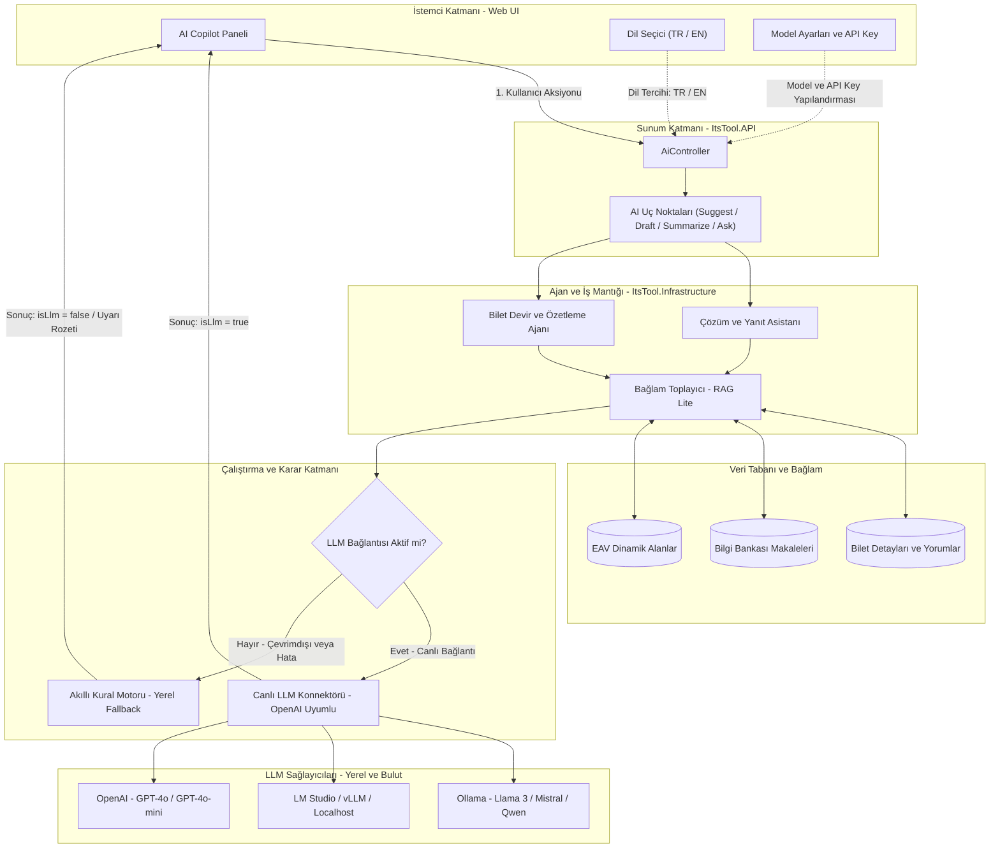

<div align="center">

# ⚡ ITSM Tool — Enterprise IT Service Management Suite

[](https://dotnet.microsoft.com/)
[](https://www.postgresql.org/)
[-4E9BCD?style=for-the-badge&logo=sonarqube&logoColor=white)](http://localhost:9000)
[](.github/workflows/ci.yml)
[](docker-compose.yml)
[](tests/ItsTool.UnitTests)
[](tests/ItsTool.UnitTests)
[](LICENSE)

<p align="center">
  <b>Modern, modüler, yapay zeka destekli ve kurumsal ITIL süreçleriyle tam uyumlu yeni nesil BT Hizmet Yönetimi (ITSM) Platformu.</b>
  <br />
  <i>Clean Architecture • Entity-Attribute-Value (EAV) Dinamik Formlar • AI Resolution Copilot • Gerçek Zamanlı SignalR • Dinamik SLA Motoru</i>
</p>

[Özellikler](#-öne-çıkan-özellikler) • [Mimari](#-sistem-mimarisi) • [AI / LLM Mimarisi](#-yapay-zeka-ai--llm-copilot-mimarisi) • [Klavye Kısayolları](#-klavye-kısayolları-power-user-hotkeys) • [Test & SonarQube](#-kod-kalitesi--sonarqube) • [Kurulum](#-hızlı-kurulum) • [Demo Hesaplar](#-demo-hesaplar) • [API Dokümantasyonu](#-api-mimarisi--başlıca-endpointler)

---

</div>

## 🌟 Öne Çıkan Özellikler

| Kategori | Yetenek & Açıklama |
| :--- | :--- |
| 🤖 **AI Resolution Copilot** | Bilet geçmişi, kullanıcı yorumları ve benzer biletleri analiz ederek **otomatik çözüm önerileri**, **taslak yanıtlar**, **makale eşleştirmeleri** ve **akıllı devir (handoff)** özetleri üretir. |
| ⏱️ **Dinamik SLA Motoru** | Öncelik ve proje bazlı özelleştirilebilir ilk yanıt & çözüm süreleri; bekleme durumunda (`On Hold`) otomatik sayaç durdurma; mesai saati hesaplaması ve **ihlal öncesi proaktif eskalasyon uyarıları**. |
| 📋 **EAV Dinamik Form Motoru** | Kod değişikliği gerektirmeden proje ve kategori bazlı özel alan tanımlama (Metin, Sayı, Tarih, Açılır Liste, Çoklu Seçim). |
| 🔄 **Durum Makinesi & İş Akışları** | ITIL uyumlu Incident / Request yaşam döngüsü; admin panelinden dinamik olarak yönetilen durum geçiş kuralları (`WorkflowTransitions`). |
| 🛡️ **Gelişmiş Yetkilendirme (RBAC+)** | Rol Tabanlı Erişim Kontrolü (RBAC) üzerine inşa edilmiş, kullanıcı bazında tekil izin ekleme/çıkarma sağlayan **Claim Override** mimarisi. |
| ⚡ **Gerçek Zamanlı İletişim (SignalR)** | Bilet atamaları, durum güncellemeleri, SLA uyarıları ve `@bahsetme` bildirimleri anlık olarak tarayıcıya iletilir. |
| 📊 **Yönetici Paneli & Analitik** | KPI kartları, SLA uyum grafikleri, departman/teknisyen iş yükü ısı haritaları, filtreleme ve CSV/PDF dışa aktarma. |
| 🔍 **Bilgi Bankası (KB)** | Sıkça sorulan sorular, kategori hiyerarşisi, zengin içerikli makaleler, görüntülenme sayaçları ve onay mekanizması. |
| 🎨 **Zero-Bloat Vanilla UI** | Ağır JS framework'leri olmadan ultra hızlı çalışan, responsive, **Dark / Light tema** ve **TR / EN çoklu dil** destekli modern arayüz. |

---

## 🛠️ Detaylı Teknoloji Yığını (Tech Stack)

| Alan | Teknoloji & Kütüphane | Kullanım Amacı & Mimari Rolü |
| :--- | :--- | :--- |
| **Backend** | **.NET 8 (C# 12)** / ASP.NET Core | Yüksek performanslı, asenkron ve modüler RESTful API mimarisi |
| **Veritabanı & ORM** | **PostgreSQL 16** / **EF Core 8** (Npgsql) | İlişkisel veri saklama, Code-First migration'lar, Transaction & Interceptor desteği |
| **Gerçek Zamanlı İletişim** | **ASP.NET Core SignalR** | Bilet atama, durum değişikliği ve SLA uyarılarının istemcilere anlık push edilmesi |
| **Yapay Zeka (AI)** | **Multi-Agent AI Copilot (LLM)** | Geçmiş çözülmüş biletleri ve KB makalelerini analiz ederek çözüm önerisi ve taslak yanıt üretimi |
| **Frontend** | **Vanilla JS (ES6+ Modules)**, HTML5, CSS3 | Sıfır bağımlılık şişkinliği (zero-bloat), ultra hızlı render, Dark/Light tema ve i18n dil sözlüğü |
| **Grafik & Görselleştirme** | **Chart.js** & **Bootstrap 5 (Grid/Modal)** | Yönetici dashboard'unda KPI, SLA uyum ve bilet dağılım grafiklerinin dinamik çizimi |
| **Konteynerizasyon** | **Docker** & **Docker Compose** | Multi-stage build ile hafif üretim imajları ve tek komutla izole PostgreSQL orkestrasyonu |
| **Sürekli Entegrasyon (CI)**| **GitHub Actions** | Push ve PR'larda otomatik Ubuntu ortamı kurulumu, derleme ve test doğrulama |
| **Birim Testleri** | **xUnit**, **Moq**, **Coverlet** | 358 birim testi ve %85.34 satır kapsamı (Line Coverage) |
| **Statik Kod Analizi** | **SonarQube** | 0 Bug, 0 Güvenlik Açığı, 0 Code Smell ile tam Kalite Kapısı (Quality Gate) onayı |
| **API Dokümantasyonu** | **Swagger / OpenAPI (Swashbuckle)** | JWT Bearer kimlik doğrulaması destekli interaktif API test arayüzü |
| **Güvenlik** | **JWT & Claim Override (RBAC+)** | PBKDF2 parola tuzlama, kullanıcı bazlı tekil izin ezme, ReDoS önleyici Regex zaman aşımları |

---

## 💡 Nasıl Yapıldı? (Mimari ve Tasarım Tercihleri)

1. **Clean Architecture (Onion Mimarisi):**
   - Bağımlılıklar daima dıştan içe (Domain <- Application <- Infrastructure <- API) doğrudur.
   - `ItsTool.Domain` tamamen saf C# POCO nesneleridir, hiçbir harici veritabanı kütüphanesine bağımlı değildir. Bu sayede iş mantığı teknolojiden bağımsız kalır.
2. **EAV (Entity-Attribute-Value) Dinamik Form Motoru:**
   - Farklı projeler (örn. İK için "Çalışan Departmanı", Yazılım için "Git Commit Hash") farklı alanlar gerektirir. Veritabanında her seferinde tablo değiştirmek yerine EAV deseni uygulanarak admin panelinden anlık yeni form alanları tanımlanabilir.
3. **Dinamik Durum Makinesi (Workflow State Machine):**
   - "Açık" bileti kimler "Çözüldü" yapabilir? Bu kurallar C# koduna hardcode edilmemiştir. `WorkflowTransitions` tablosu üzerinden dinamik olarak yapılandırılır ve doğrulanır.
4. **Kesintisiz Arka Plan Görevleri (Hosted Background Services):**
   - `SlaCheckerService`: Her dakika arka planda çalışarak süresi dolmak üzere olan veya ihlal edilen biletleri tespit eder, SignalR üzerinden ilgili teknisyenlere sesli/görsel uyarı gönderir.
   - `EmailBackgroundService`: E-posta gönderimlerini ana thread'i bloke etmeden `InMemoryEmailQueue` üzerinden asenkron tüketir.
5. **Otomatik Denetim İzi (SystemAuditInterceptor):**
   - EF Core Change Tracker'a bağlanan interceptor, herhangi bir bilet veya kullanıcı güncellendiğinde hangi alanın eski değerinin ne olduğunu, yeni değerinin ne olduğunu ve işlemi kimin yaptığını `SystemAuditLogs` tablosuna yazar.

---

## 🏛️ Sistem Mimarisi

Proje, **Clean Architecture (Onion Architecture)** prensiplerine tam sadık kalınarak katmanlar arası gevşek bağlılık (loose coupling) ve yüksek test edilebilirlik hedefiyle inşa edilmiştir:


### 📁 Katman Yapısı

```
itsm-tool/
├── src/
│   ├── ItsTool.Domain/          # Saf iş modelleri, Entity'ler, EAV yapıları, Base interfaceler
│   ├── ItsTool.Application/     # İş kuralları arayüzleri, DTO'lar, servis sözleşmeleri
│   ├── ItsTool.Infrastructure/  # EF Core DbContext, PostgreSQL eşleşmeleri, SLA & AI servisleri
│   ├── ItsTool.API/             # ASP.NET Core Web API, JWT Auth, SignalR Hub, Controller'lar
│   └── ItsTool.Web/             # Vanilla JS, responsive HTML5 sayfaları ve statik varlıklar (wwwroot)
├── tests/
│   └── ItsTool.UnitTests/       # 358 birim ve entegrasyon testi, InMemory SQLite altyapısı
└── docs/                        # Mimari tasarım, ERD, gereksinim ve geliştirme notları
```

---

## 🧠 Yapay Zeka (AI / LLM) Copilot Mimarisi

ITSM Tool, destek temsilcilerinin operasyonel yükünü hafifletmek, bilet çözüm sürelerini (MTTR) minimize etmek ve yanıt kalitesini standartlaştırmak için **hibrit ve çok katmanlı bir yapay zeka mimarisine** sahiptir.

### 📐 AI Copilot Akış Şeması



---

### 🔑 AI Mimarimizin 6 Temel İlkesi

#### 1. 🛡️ Çift Modlu Çalışma & Kesintisiz Hizmet Garantisi (Dual-Engine Fallback)
- **Problem:** Bulut tabanlı LLM API'larında ağ kesintileri, hız kısıtlamaları (rate-limit) veya yerel modellerde bellek yetersizliği yaşandığında destek teknisyeninin ekranı donmamalıdır.
- **Çözüm:** Sistem **Sıfır Kesinti (Zero Downtime)** prensibiyle çalışır:
  - Canlı LLM bağlantısı varsa derinlemesine model çıktısı alınır (`isLlm: true`).
  - LLM erişilemezse veya kapalıysa, sistem **asla hata fırlatmaz**; anında bilet kategorisini, önceliğini, geçmiş müdahalelerini ve ilgili KB makalelerini analiz eden **yerel kural motoruna (Smart Heuristic Fallback)** devredilir (`isLlm: false`).
  - Kullanıcı arayüzünde şeffaflık sağlanarak yanıtın kural motorundan geldiği ve harici model bağlamak için ayarların kontrol edilmesi gerektiği açıkça belirtilir.

#### 2. 📚 RAG Mimarisi: Çok Kaynaklı Yapılandırılmış Hibrit RAG (Structured Multi-Source Hybrid RAG)
ITSM Tool, genel geçer serbest metin vektör aramaları yerine kurumsal BT destek süreçlerine özel olarak tasarlanmış **Structured Multi-Source Hybrid RAG (Çok Kaynaklı Yapılandırılmış Hibrit RAG)** mimarisini kullanır. Bu mimari, sistemdeki ilişkisel veri hiyerarşisi, kurumsal bilgi bankası ve geçmiş bilet tecrübesini birleştirerek modele sıfır halüsinasyon garantisiyle bağlam sunar.

##### 🔄 RAG Çalışma Akışı ve Aşamaları:
1. **Taksonomi ve Varlık Filtreli Getirim (Taxonomy & Entity-Filtered Retrieval):**
   - Aktif biletin kategori (`CategoryId`), öncelik (`PriorityId`) ve etiketleri analiz edilir.
   - Veritabanındaki binlerce bilet taranarak aynı kategoride daha önce başarıyla **kapatılmış ve çözülmüş biletler** (`GetSimilarTicketsAsync`) doğrulanmış çözüm referansları (*Ground Truth / Few-Shot In-Context Learning*) olarak çekilir.
2. **Bilgi Bankası Sözlüksel & Semantik Getirimi (KB Retrieval):**
   - Bilet başlığı ve kategori kimliği üzerinden kurumsal Bilgi Bankası (`KnowledgeArticles`) taranır.
   - Onaylanmış kurumsal kılavuzlar, sıkça sorulan sorular ve standart işletim prosedürleri (SOP) getirilerek yanıta resmiyet kazandırılır.
3. **Kronolojik Etkileşim ve Zaman Çizelgesi Getirimi (Temporal Discussion Retrieval):**
   - Bilet altındaki kullanıcı yorumları ve teknisyenin dahili notları (`TicketComments`) kronolojik sırayla çekilir.
   - Böylece yapay zeka, bilet üzerinde şimdiye kadar hangi adımların denendiğini, kullanıcının verdiği son geri bildirimleri ve devam eden aksiyonları eksiksiz bilir.
4. **Dinamik EAV Alanları Getirimi (Schema-Aware Dynamic Field Retrieval):**
   - Bilete form motoru tarafından eklenmiş özel dinamik alanlar (`Sunucu Adı`, `Hata Kodu`, `Etkilenen Departman` vb.) toplanır.
5. **Bağlamsal Zenginleştirme ve Prompt Enjeksiyonu (Augmentation Layer):**
   - Toplanan tüm veriler (Bilet + Çözülmüş Benzer Vakalar + KB Makaleleri + Zaman Çizelgesi), yapılandırılmış JSON ve semantik metin blokları halinde prompt'a gömülür.
   - Modele: *"Yalnızca sana sunulan geçmiş başarılı çözümlere ve kurumsal bilgi bankası prosedürlerine sadık kalarak, halüsinasyon üretmeden BT teknisyeni için adım adım aksiyon planı oluştur"* talimatı verilir.
6. **Çift Motorlu Sentez (Dual-Engine Synthesis):**
   - **Canlı LLM:** OpenAI uyumlu yerel/bulut modeller zenginleştirilmiş bağlamı sentezleyip kurumsal ve temiz bir rehber üretir.
   - **Akıllı Yerel Kural Motoru (Smart Heuristic Fallback):** LLM kapalı veya erişilemez olduğunda, toplanan bu RAG bağlamı yerel kural motoru tarafından doğrudan işlenerek teknisyenin ekranına kesintisiz ulaştırılır.

##### 🎯 Neden Klasik Vektör DB Yerine Yapılandırılmış RAG?
- **Sıfır Halüsinasyon:** Model rastgele tahminlerde bulunmaz; daha önce BT ekiplerince çözülüp kapatılmış gerçek bilet kayıtlarını baz alır.
- **Ultra Düşük Gecikme & Sıfır Maliyet:** Harici vektör veritabanı (Pinecone, Qdrant vb.) veya harici embedding API bağımlılığı olmadan, PostgreSQL'in güçlü ilişkisel indeksleri sayesinde getirim işlemi **5 milisaniyenin altında** gerçekleşir.

#### 3. 🌐 Çok Dilli Zeka & Prompt Sentezi (TR / EN)
- Arayüz üzerinden tek tıkla **🇹🇷 TR** veya **🇬🇧 EN** yanıt dili seçilebilir ve tercih `localStorage` üzerinde saklanır.
- Arka plandaki akıllı ajanlar (**Çözüm ve Yanıt Asistanı** ile **Bilet Devir ve Özetleme Ajanı**), seçilen dile göre dinamik sistem talimatları ve kullanıcı prompt'ları oluşturur:
  - **Türkçe:** Kurumsal ve profesyonel Türkçe ITIL dili ile çözüm adımları ve müşteri bildirimleri.
  - **İngilizce:** Uluslararası IT destek standartlarına (`Best regards`, `Diagnostic steps`, `Actionable troubleshooting`) tam uyumlu İngilizce çıktılar.
  - LLM bağlı olmadığında dahi yerel motor, seçilen dilde profesyonel şablonlar üretir.

#### 4. 🔌 Evrensel Model Uyumluluğu (OpenAI-Compatible Multi-Provider)
Sistem tek bir sağlayıcıya kilitlenmez (`Vendor Lock-in` yoktur). Standart OpenAI Chat Completions REST API spesifikasyonunu destekler:
- **Yerel Modeller (Zero-Cost / Offline):** [Ollama](https://ollama.ai/) (`Llama 3`, `Mistral`, `Qwen 2.5`, `Phi-3`), [LM Studio](https://lmstudio.ai/), [vLLM](https://github.com/vllm-project/vllm).
- **Bulut Modelleri:** OpenAI (`GPT-4o`, `GPT-4o-mini`), Azure OpenAI, Anthropic Claude (uyumlu proxy'ler üzerinden).
- **Docker İçi Ağ İletişimi:** `docker-compose.yml` içerisindeki `host.docker.internal:host-gateway` köprüsü sayesinde, Docker içinde koşan ITSM Tool, host makinede çalışan yerel Ollama/LM Studio servislerine doğrudan `http://host.docker.internal:11434` üzerinden erişebilir.

#### 5. 👥 Çoklu Ajan ve Görev Ayrımı (Agentic Specialization)
- **Çözüm ve Yanıt Asistanı (Resolution Copilot):** Bilet için teşhis adımları, muhtemel kök nedenler, ilgili bilgi bankası (KB) makaleleri ve son kullanıcıya iletilebilecek hazır e-posta / yorum taslaklarını üretir.
- **Bilet Devir ve Özetleme Ajanı (Ticket Handoff):** Vardiya değişimlerinde, teknisyen atamalarında veya 2. Seviye (Tier-2) uzman desteğe eskalasyonlarda biletin tüm geçmişini, teknik darboğazları ve bir sonraki teknisyenin atması gereken adımları özetleyen devir notları hazırlar.

#### 6. 🎨 Sezgisel Arayüz & Güvenli Model Yönetimi
- **Göz İkonlu API Anahtarı:** Model ayarları penceresinde API anahtarı güvenle maskelenir (`type="password"`), istenildiğinde göz ikonu ile açık metne dönüştürülüp kontrol edilebilir.
- **Üst Üste Binmeyen 2 Satırlı Başlık:** Dar yan panellerde taşma ve çakışmaları önleyen modern başlık ve durum göstergesi.
- **Canlı Gecikme Testi:** Model ayarlarından tek tıkla test isteği gönderilerek milisaniye cinsinden yanıt süresi (`latency`) ve model sağlığı ölçülür.
- **Tek Tıkla Yanıta Aktarma:** Üretilen taslak tek tıkla kopyalanabilir veya doğrudan biletin yanıt kutusuna aktarılabilir.

---

## 🧪 Kod Kalitesi & SonarQube

Proje, kurumsal kodlama standartlarına ve statik kod analizi kurallarına sıkı sıkıya bağlıdır. **SonarQube Kalite Kapısı (Quality Gate)** tüm metriklerde tam başarı sağlamıştır:

<div align="center">

| Metrik | Sonuç | Durum |
| :---: | :---: | :---: |
| **Quality Gate** | **PASSED (OK)** | 🟢 Başarılı |
| **Birim Testleri** | **385 / 385 Geçti (375 .NET + 10 JS)** | 🟢 %100 Başarı |
| **Satır Test Kapsamı (Line Coverage)** | **%85.34** | 🟢 Yüksek Kapsam |
| **Bugs** | **0** | 🟢 Sıfır Hata |
| **Vulnerabilities** | **0** | 🟢 Güvenli |
| **Security Hotspots** | **0** | 🟢 İncelendi |
| **Code Smells** | **0** | 🟢 Temiz Kod |
| **Kod Tekrarı (Duplications)** | **%1.2** (<%3.0 eşiği) | 🟢 Mükemmel |

</div>

### 📊 Katman Bazlı Test Kapsamı

```
+------------------------+--------+--------+--------+
| Modül                  | Satır  | Dal    | Metot  |
+------------------------+--------+--------+--------+
| ItsTool.Domain         | 93.43% | 100%   | 93.43% |
| ItsTool.Application    | 84.16% | 100%   | 82.84% |
| ItsTool.Infrastructure | 82.72% | 56.49% | 88.47% |
| ItsTool.API            | 92.12% | 68.75% | 96.62% |
+------------------------+--------+--------+--------+
| TOPLAM ORTALAMA        | 85.34% | 58.12% | 90.35% |
+------------------------+--------+--------+--------+
```

### 🔄 Sürekli Entegrasyon (CI/CD Pipeline)

GitHub Actions üzerinde koşan otomatik CI pipeline (`.github/workflows/ci.yml`), repoya yapılan her `push` ve `pull_request` işleminde:
1. **Ortam Hazırlığı:** Ubuntu üzerinde .NET 8 SDK'sını yapılandırır.
2. **Derleme:** Çözümün (`ItsTool.sln`) bağımlılıklarını geri yükler ve `Release` modda derler.
3. **Otomatik Testler:** 353 birim testini çalıştırarak kod kalitesini garanti eder.
4. **Kapsam Raporlama:** OpenCover formatında test kapsamı raporu oluşturup CI artifact olarak saklar.

---

## 🚀 Hızlı Kurulum

### 🐳 Yöntem 1: Docker ile Tek Komutla Çalıştırma (Önerilen)

Projeyi makinenize PostgreSQL veya .NET SDK kurmanıza gerek kalmadan Docker ile tek komutla başlatabilirsiniz:

```bash
# Projeyi klonlayın
git clone https://github.com/Berkaybbayramoglu/itsm-Tool.git
cd itsm-Tool

# Konteynerleri derleyin ve başlatın
docker compose up -d --build
```

> 💡 *PostgreSQL 16 ve ITSM Tool API konteynerleri otomatik ayağa kalkar, veritabanı şeması migrate edilir ve demo veriler tohumlanır.*  
> Tarayıcınızdan **`http://localhost:5246`** adresine giderek hemen giriş yapabilirsiniz.  
> Konteynerleri durdurmak için: `docker compose down`

---

### 💻 Yöntem 2: Yerel Geliştirme Ortamı (Manuel)

#### 1. Gereksinimler
- [.NET 8.0 SDK](https://dotnet.microsoft.com/download/dotnet/8.0)
- [PostgreSQL 14+](https://www.postgresql.org/download/)
- [Git](https://git-scm.com/)

### 2. Projeyi Klonlayın
```bash
git clone https://github.com/Berkaybbayramoglu/itsm-Tool.git
cd itsm-Tool
```

### 3. Veritabanı Yapılandırması
PostgreSQL sunucunuzda `itsm_tool` adında bir veritabanı oluşturun ve `src/ItsTool.API/appsettings.Development.json` dosyasındaki bağlantı dizesini düzenleyin:

```json
{
  "ConnectionStrings": {
    "DefaultConnection": "Host=localhost;Port=5432;Database=itsm_tool;Username=postgres;Password=YOUR_PASSWORD"
  }
}
```

### 4. Uygulamayı Başlatın

**Terminal 1 — API Sunucusu:**
```bash
dotnet run --project src/ItsTool.API
```
> 💡 *Not: API ilk açılışta veritabanı şemasını otomatik oluşturur ve `DataSeeder` ile örnek projeleri, grupları, SLA politikalarını ve demo kullanıcıları tohumlar.*

**Terminal 2 — Web Kullanıcı Arayüzü:**
```bash
dotnet run --project src/ItsTool.Web
```

Tarayıcınızdan **`http://localhost:5246`** adresine giderek uygulamayı kullanmaya başlayabilirsiniz.

### 5. Birim Testlerini Çalıştırma
```bash
dotnet test tests/ItsTool.UnitTests/ItsTool.UnitTests.csproj /p:CollectCoverage=true
```

---

## 🔑 Demo Hesaplar

Sistem başlatıldığında hazır gelen test kullanıcıları (**Tüm şifreler:** `123456`):

| Kullanıcı Adı | Rol | Yetki & Sorumluluk Alanı |
| :--- | :--- | :--- |
| `admin` | **SuperAdmin** | Sistem geneli tam yetki; SLA, Proje, Rol, Kullanıcı ve Dinamik Form yönetimi |
| `manager` | **Manager** | Raporlama, SLA inceleme, Yönetim panelleri ve Bilgi Bankası onayları |
| `agent1` | **Agent** | Standart Destek Temsilcisi; bilet çözme, durum güncelleme, devir alma |
| `agent2` | **Agent (Override)** | Standart Temsilci + Claim Override ile verilmiş `ticket.close` yetkisi |
| `user1` | **EndUser** | Son kullanıcı; talep açma, kendi biletlerini izleme, memnuniyet anketi |

---

## ⌨️ Klavye Kısayolları (Power-User Hotkeys)

Sistem genelinde hızlı gezinme, operasyonel hız ve erişilebilirlik için global klavye kısayolları tanımlanmıştır. Herhangi bir ekrandayken fare kullanmadan kritik aksiyonları tetikleyebilirsiniz:

| Tuş / Kısayol | Fonksiyon | Açıklama |
| :---: | :--- | :--- |
| <kbd>/</kbd> | **Hızlı Arama** | Sayfadaki arama çubuğuna (`#searchInput`) anında odaklanır ve metni seçer. |
| <kbd>Esc</kbd> | **Pencereleri Kapat** | Açık olan tüm modal pencereleri, açılır menüleri ve profil detay panelini kapatır. |
| <kbd>?</kbd> veya <kbd>Shift</kbd> + <kbd>/</kbd> | **Kısayol Rehberi** | Ekranda interaktif kısayol yardım penceresini açar / kapatır. |
| <kbd>N</kbd> | **Yeni Bilet** | Yeni bilet oluşturma formunu (`/ticket-create.html`) anında açar. |
| <kbd>T</kbd> | **Biletler Listesi** | Bilet listesi ve arama sayfasına (`/tickets.html`) yönlendirir. |
| <kbd>D</kbd> | **Dashboard** | Genel kontrol paneline (`/dashboard.html`) yönlendirir. |

> 💡 **Kısayolları Keşfetme & UI Erişimi:**
> - **Üst Çubuk (Topbar):** Tüm sayfaların sağ üst köşesinde yer alan **klavye simgesine (⌨️)** tıklayarak kısayol rehberine her an ulaşabilirsiniz.
> - **Profil Paneli:** Sağ üstteki kullanıcı avatarına tıklandığında açılan profil penceresinin altında **"Klavye Kısayolları (?)"** bağlantısı bulunur.
> - **Arama Çubuğu Rozeti:** Biletler sayfasında arama kutusunun sağında yer alan `<kbd>/</kbd>` etiketi, kısayol kullanımını görsel olarak hatırlatır.
> - **Akıllı Odaklama:** Form giriş alanlarında (input, textarea vb.) yazı yazarken kısayollar harf yazımınızı engellemez, yalnızca serbest gezinme esnasında tetiklenir.

---

## 📡 API Mimarisi & Başlıca Endpoint'ler

Tüm endpoint'ler Swagger / OpenAPI UI üzerinden interaktif olarak test edilebilir (`http://localhost:5246/swagger`).

<details>
<summary><b>🔍 Başlıca REST API Endpoint Listesini Görüntüle</b></summary>

| Modül | Metot | Endpoint | Açıklama |
| :--- | :--- | :--- | :--- |
| **Auth** | `POST` | `/api/auth/login` | JWT token üretimi ve kullanıcı doğrulaması |
| **Tickets** | `GET` | `/api/ticket` | Sayfalanmış, filtrelenmiş bilet listesi |
| | `POST` | `/api/ticket` | Yeni bilet oluşturma (Dinamik alanlar dahil) |
| | `GET` | `/api/ticket/{id}` | Bilet detayları, yorumlar, ekler ve denetim izi |
| | `POST` | `/api/ticket/{id}/transition` | İzin verilen durum geçişi uygulama |
| | `POST` | `/api/ticket/{id}/assign` | Bilet teknisyen/grup atama ve devir |
| **SLA** | `GET` | `/api/sla/policies` | SLA politikaları ve hedef süreleri |
| | `PUT` | `/api/sla/policies/{id}` | Politika ve hedef süre güncelleme |
| **AI Copilot** | `POST` | `/api/ai/tickets/{id}/suggest-resolution` | AI tabanlı çözüm önerisi üretme |
| | `POST` | `/api/ai/tickets/{id}/draft-reply` | Müşteriye iletilecek taslak yanıt oluşturma |
| | `POST` | `/api/ai/tickets/{id}/summarize` | Bilet geçmişi ve yorum özetleme |
| **Dashboard** | `GET` | `/api/dashboard/overview` | KPI sayıları, SLA uyum oranları |
| | `GET` | `/api/dashboard/distributions` | Öncelik, kategori ve durum dağılımları |
| **KB** | `GET` | `/api/knowledgebase/articles` | Yayınlanmış makaleler ve arama |
| **Dynamic Forms** | `GET` | `/api/dynamicform/fields` | Dinamik alan tanımları |

</details>

---

## 🔒 Güvenlik & Standartlar

- **Yetkilendirme:** Claim tabanlı JWT Bearer Token ile güvenli kimlik doğrulama.
- **Audit Trail:** EF Core `SystemAuditInterceptor` ile tüm varlık ekleme, güncelleme ve silme işlemlerinde kullanıcı ve zaman damgalı tam denetim izi.
- **ReDoS Koruması:** Regex aramalarında ve HTML etiket temizlemelerinde katı Regex Timeout sınırları (CWE-1333 önlemi).
- **Parola Güvenliği:** PBKDF2 / ASP.NET Identity PasswordHasher ile tuzlanmış (salted) güvenli şifreleme.
- **Soft Delete:** Veri kaybını önleyen ve ilişkisel bütünlüğü koruyan `ISoftDelete` deseni.

---

## 📄 Lisans

Bu proje [MIT Lisansı](LICENSE) kapsamında lisanslanmıştır.

---

<div align="center">
  <b>Geliştirici:</b> Berkay Bayramoğlu • <a href="mailto:berkaybbayramoglu@gmail.com">berkaybbayramoglu@gmail.com</a>
  <br />
  <sub>Proje hoşunuza gittiyse sağ üst köşeden ⭐️ <b>Star</b> vermeyi unutmayın!</sub>
</div>
